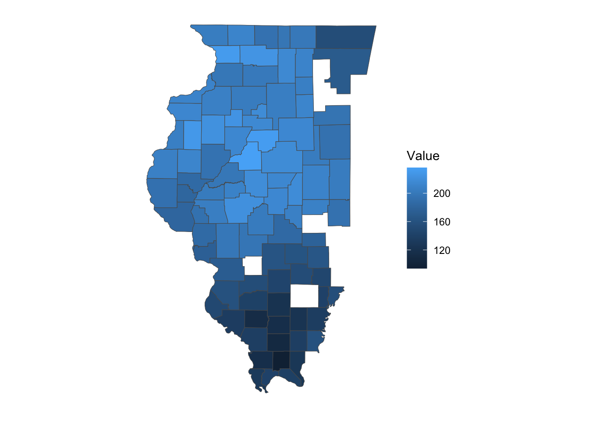
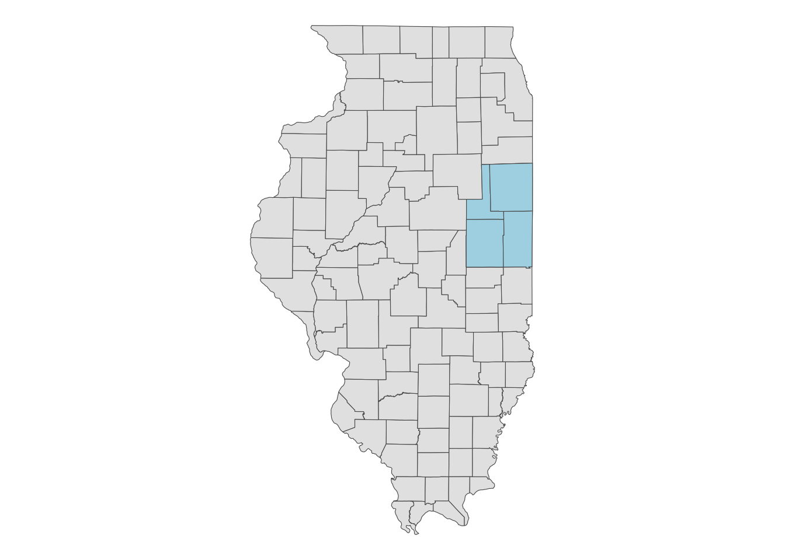
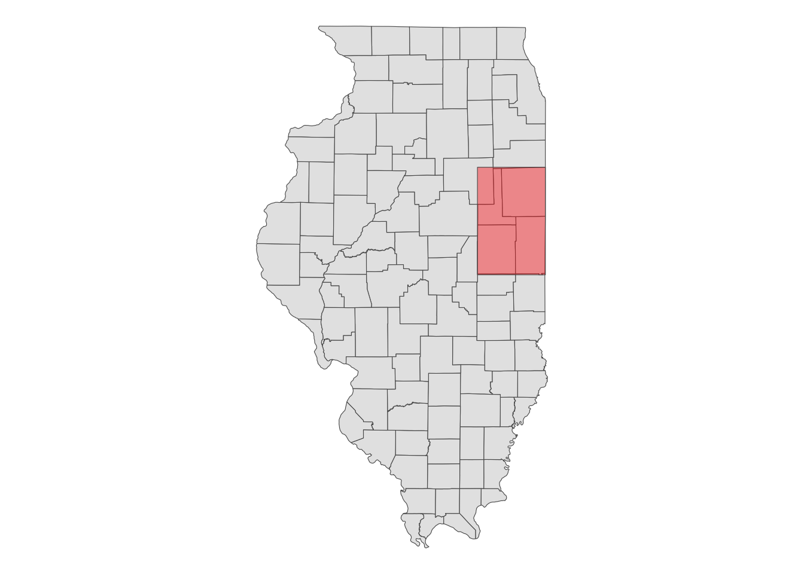
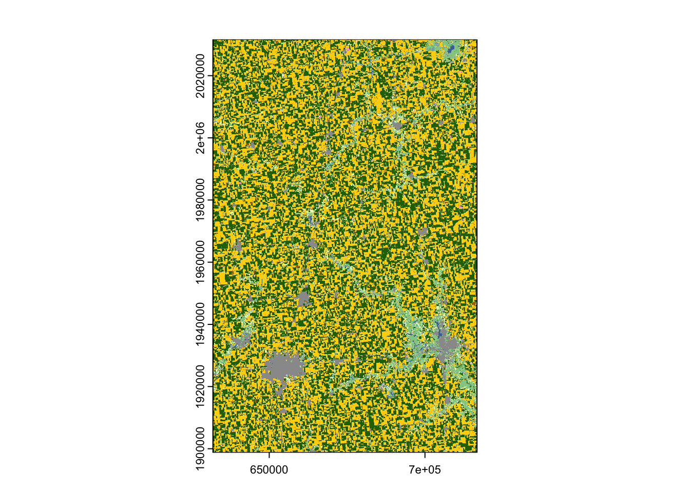
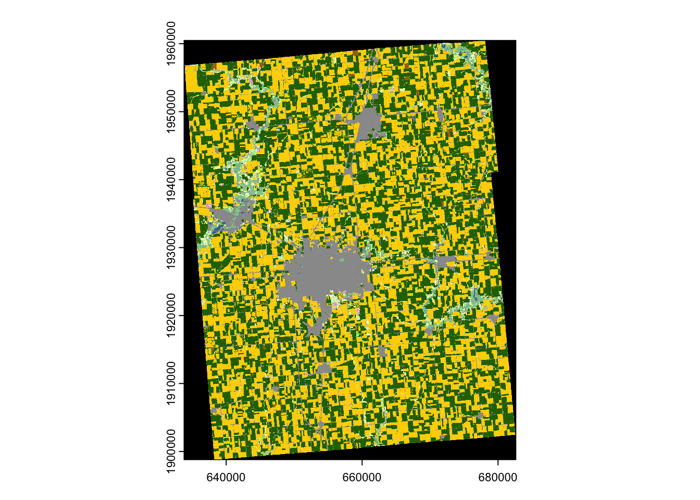
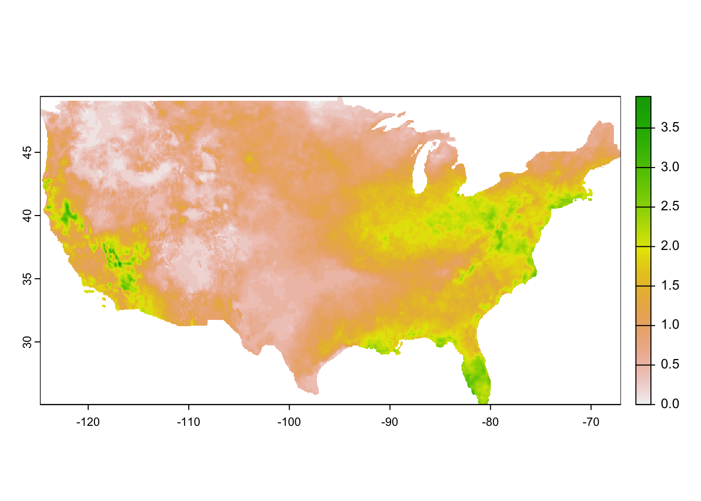

# Download and process spatial datasets from within R {#sec-download-data}

## Before you start {-}

There are many publicly available spatial datasets that can be downloaded using R. Programming data downloading using R instead of manually downloading data from websites can save lots of time and also enhances the reproducibility of your analysis. In this section, we will introduce some of such datasets and show how to download and process those data.  

### Direction for replication {-}

**Datasets**

No datasets to download for this Chapter.

**Packages**

+ Run the following code to install or load (if already installed) the `pacman` package, and then install or load (if already installed) the listed package inside the `pacman::p_load()` function.


::: {.cell}

```{.r .cell-code}
if (!require("pacman")) install.packages("pacman")
pacman::p_load(
  stars, # spatiotemporal data handling
  terra, # raster data handling
  raster, # raster data handling
  sf, # vector data handling
  dplyr, # data wrangling
  stringr, # string manipulation
  lubridate, # dates handling
  data.table, # data wrangling
  tidyr, # reshape
  tidyUSDA, # download USDA NASS data
  keyring, # API key management
  FedData, # download Daymet data
  daymetr, # download Daymet data
  ggplot2, # make maps
  ggthemes, # ggplot themes
  tmap, # make maps
  future.apply, # parallel processing
  CropScapeR, # download CDL data
  prism, # download PRISM data
  exactextractr # extract raster values to sf
)
```
:::


+ Run the following code to define the theme for map:


::: {.cell}

```{.r .cell-code}
ggplot2::theme_set(theme_bw())

theme_for_map <- theme(
  axis.ticks = element_blank(),
  axis.text = element_blank(),
  axis.line = element_blank(),
  panel.border = element_blank(),
  panel.grid.major = element_line(color = "transparent"),
  panel.grid.minor = element_line(color = "transparent"),
  panel.background = element_blank(),
  plot.background = element_rect(fill = "transparent", color = "transparent")
)
```
:::


## USDA NASS QuickStat with `tidyUSDA` {#sec-nass-quick}

There are several packages available to download data from the USDA NASS QuickStat. In this example, we will use the [tidyUSDA package](https://github.com/bradlindblad/tidyUSDA) [@tidyUSDA]. A great feature of tidyUSDA is that it allows you to download data as an `sf` object, which means you can immediately visualize or spatially interact with other spatial data.

The first step is to obtain an API key from the this [website](https://quickstats.nass.usda.gov/api), as you will need it to download data.

To download data, use the `tidyUSDA::getQuickstat()` function. There are numerous options to narrow the scope of the data, such as `data_item`, `geographic_level`, `year`, `commodity`, and more. You can refer to the [package manual](https://cran.r-project.org/web/packages/tidyUSDA/tidyUSDA.pdf) for a complete list of available parameters.

As an example, the code below downloads corn-related data by county in Illinois for the year 2016 as an sf object:


::: {.cell}

```{.r .cell-code}
(
  IL_corn_yield <-
    getQuickstat(
      #--- put your API key in place of key_get("usda_nass_qs_api") ---#
      key = key_get("usda_nass_qs_api"),
      program = "SURVEY",
      commodity = "CORN",
      geographic_level = "COUNTY",
      state = "ILLINOIS",
      year = "2016",
      geometry = TRUE
    ) %>%
    #--- keep only some of the variables ---#
    dplyr::select(
      year, county_name, county_code, state_name,
      state_fips_code, short_desc, Value
    )
)
```
:::

::: {.cell}
::: {.cell-output .cell-output-stdout}

```
Simple feature collection with 384 features and 7 fields (with 16 geometries empty)
Geometry type: MULTIPOLYGON
Dimension:     XY
Bounding box:  xmin: -91.51308 ymin: 36.9703 xmax: -87.01993 ymax: 42.50848
Geodetic CRS:  NAD83
First 10 features:
   year county_name county_code state_name state_fips_code           short_desc
1  2016      BUREAU         011   ILLINOIS              17 CORN - ACRES PLANTED
2  2016     CARROLL         015   ILLINOIS              17 CORN - ACRES PLANTED
3  2016       HENRY         073   ILLINOIS              17 CORN - ACRES PLANTED
4  2016  JO DAVIESS         085   ILLINOIS              17 CORN - ACRES PLANTED
5  2016         LEE         103   ILLINOIS              17 CORN - ACRES PLANTED
6  2016      MERCER         131   ILLINOIS              17 CORN - ACRES PLANTED
7  2016        OGLE         141   ILLINOIS              17 CORN - ACRES PLANTED
8  2016      PUTNAM         155   ILLINOIS              17 CORN - ACRES PLANTED
9  2016 ROCK ISLAND         161   ILLINOIS              17 CORN - ACRES PLANTED
10 2016  STEPHENSON         177   ILLINOIS              17 CORN - ACRES PLANTED
    Value                       geometry
1  273500 MULTIPOLYGON (((-89.85691 4...
2  147500 MULTIPOLYGON (((-90.16133 4...
3  235000 MULTIPOLYGON (((-90.43247 4...
4  100500 MULTIPOLYGON (((-90.50668 4...
5  258500 MULTIPOLYGON (((-89.63118 4...
6  142500 MULTIPOLYGON (((-90.99255 4...
7  228000 MULTIPOLYGON (((-89.68598 4...
8   37200 MULTIPOLYGON (((-89.33303 4...
9   65000 MULTIPOLYGON (((-90.33573 4...
10 179500 MULTIPOLYGON (((-89.92577 4...
```


:::
:::


As you can see, the result is an sf object with a geometry column, thanks to the `geometry = TRUE` option. This allows you to immediately create a map with the data (@fig-corn-yield-IL).

::: {.column-margin}


::: {.cell}

```{.r .cell-code  code-fold="true"}
ggplot() +
  geom_sf(
    data = filter(IL_corn_yield, short_desc == "CORN, GRAIN - YIELD, MEASURED IN BU / ACRE"),
    aes(fill = Value)
  ) +
  theme_for_map
```

::: {.cell-output-display}
{#fig-corn-yield-IL width=672}
:::
:::


:::
<!--end of column-margin-->

You can also download data for multiple states and years simultaneously, as shown in the example below. If you want data for the entire U.S., simply omit the state parameter.


::: {.cell}

```{.r .cell-code}
(
  IL_CO_NE_corn <-
    getQuickstat(
      key = key_get("usda_nass_qs_api"),
      program = "SURVEY",
      commodity = "CORN",
      geographic_level = "COUNTY",
      state = c("ILLINOIS", "COLORADO", "NEBRASKA"),
      year = paste(2014:2018),
      geometry = TRUE
    ) %>%
    #--- keep only some of the variables ---#
    dplyr::select(
      year, county_name, county_code, state_name,
      state_fips_code, short_desc, Value
    )
)
```
:::

::: {.cell}
::: {.cell-output .cell-output-stdout}

```
Simple feature collection with 6384 features and 7 fields (with 588 geometries empty)
Geometry type: MULTIPOLYGON
Dimension:     XY
Bounding box:  xmin: -109.0459 ymin: 36.9703 xmax: -87.01993 ymax: 43.00171
Geodetic CRS:  NAD83
First 10 features:
   year               county_name county_code state_name state_fips_code
1  2018 OTHER (COMBINED) COUNTIES         998   COLORADO              08
2  2017 OTHER (COMBINED) COUNTIES         998   COLORADO              08
3  2016 OTHER (COMBINED) COUNTIES         998   COLORADO              08
4  2015 OTHER (COMBINED) COUNTIES         998   COLORADO              08
5  2014 OTHER (COMBINED) COUNTIES         998   COLORADO              08
6  2017                   BOULDER         013   COLORADO              08
7  2016                   BOULDER         013   COLORADO              08
8  2016                   LARIMER         069   COLORADO              08
9  2015                   LARIMER         069   COLORADO              08
10 2014                   LARIMER         069   COLORADO              08
             short_desc  Value                       geometry
1  CORN - ACRES PLANTED 107600             MULTIPOLYGON EMPTY
2  CORN - ACRES PLANTED 108900             MULTIPOLYGON EMPTY
3  CORN - ACRES PLANTED 163600             MULTIPOLYGON EMPTY
4  CORN - ACRES PLANTED   3100             MULTIPOLYGON EMPTY
5  CORN - ACRES PLANTED   5200             MULTIPOLYGON EMPTY
6  CORN - ACRES PLANTED   3000 MULTIPOLYGON (((-105.6486 4...
7  CORN - ACRES PLANTED   3300 MULTIPOLYGON (((-105.6486 4...
8  CORN - ACRES PLANTED  12800 MULTIPOLYGON (((-105.8225 4...
9  CORN - ACRES PLANTED  14900 MULTIPOLYGON (((-105.8225 4...
10 CORN - ACRES PLANTED  13600 MULTIPOLYGON (((-105.8225 4...
```


:::
:::


### Look for parameter values

This package includes a function that allows you to view all possible parameter values for many of the parameters. For instance, if you know you want data on irrigated corn yields in Colorado but are unsure of the exact string to provide for the `data_item` parameter, you can do the following:^[Alternatively, you can visit the QuickStat website to find the correct text values.]


::: {.cell}

```{.r .cell-code}
#--- get all the possible values for data_item ---#
all_items <- tidyUSDA::allDataItem

#--- take a look at the first six ---#
head(all_items)
```

::: {.cell-output .cell-output-stdout}

```
                                                                           short_desc1 
                                                                     "AG LAND - ACRES" 
                                                                           short_desc2 
                                                      "AG LAND - NUMBER OF OPERATIONS" 
                                                                           short_desc3 
                                                   "AG LAND - OPERATIONS WITH TREATED" 
                                                                           short_desc4 
                                                "AG LAND - TREATED, MEASURED IN ACRES" 
                                                                           short_desc5 
                           "AG LAND, (EXCL CROPLAND & PASTURELAND & WOODLAND) - ACRES" 
                                                                           short_desc6 
"AG LAND, (EXCL CROPLAND & PASTURELAND & WOODLAND) - AREA, MEASURED IN PCT OF AG LAND" 
```


:::
:::


You can use key words like "CORN", "YIELD", "IRRIGATED" to narrow the entire list using `grep()`^[`grep()` is part of the base package, so no additional package install is needed.]: 


::: {.cell}

```{.r .cell-code}
all_items %>%
  grep(pattern = "CORN", ., value = TRUE) %>%
  grep(pattern = "YIELD", ., value = TRUE) %>%
  grep(pattern = "IRRIGATED", ., value = TRUE)
```

::: {.cell-output .cell-output-stdout}

```
                                                          short_desc9227 
                 "CORN, GRAIN, IRRIGATED - YIELD, MEASURED IN BU / ACRE" 
                                                          short_desc9228 
     "CORN, GRAIN, IRRIGATED - YIELD, MEASURED IN BU / NET PLANTED ACRE" 
                                                          short_desc9233 
    "CORN, GRAIN, IRRIGATED, ENTIRE CROP - YIELD, MEASURED IN BU / ACRE" 
                                                          short_desc9236 
   "CORN, GRAIN, IRRIGATED, NONE OF CROP - YIELD, MEASURED IN BU / ACRE" 
                                                          short_desc9238 
   "CORN, GRAIN, IRRIGATED, PART OF CROP - YIELD, MEASURED IN BU / ACRE" 
                                                          short_desc9249 
             "CORN, GRAIN, NON-IRRIGATED - YIELD, MEASURED IN BU / ACRE" 
                                                          short_desc9250 
 "CORN, GRAIN, NON-IRRIGATED - YIELD, MEASURED IN BU / NET PLANTED ACRE" 
                                                          short_desc9291 
              "CORN, SILAGE, IRRIGATED - YIELD, MEASURED IN TONS / ACRE" 
                                                          short_desc9296 
 "CORN, SILAGE, IRRIGATED, ENTIRE CROP - YIELD, MEASURED IN TONS / ACRE" 
                                                          short_desc9299 
"CORN, SILAGE, IRRIGATED, NONE OF CROP - YIELD, MEASURED IN TONS / ACRE" 
                                                          short_desc9301 
"CORN, SILAGE, IRRIGATED, PART OF CROP - YIELD, MEASURED IN TONS / ACRE" 
                                                          short_desc9307 
          "CORN, SILAGE, NON-IRRIGATED - YIELD, MEASURED IN TONS / ACRE" 
                                                         short_desc28557 
                 "SWEET CORN, IRRIGATED - YIELD, MEASURED IN CWT / ACRE" 
                                                         short_desc28564 
             "SWEET CORN, NON-IRRIGATED - YIELD, MEASURED IN CWT / ACRE" 
```


:::
:::


Looking at the list, we know the exact text value we want, which is the first entry of the vector.


::: {.cell}

```{.r .cell-code}
(
  CO_ir_corn_yield <-
    getQuickstat(
      key = key_get("usda_nass_qs_api"),
      program = "SURVEY",
      data_item = "CORN, GRAIN, IRRIGATED - YIELD, MEASURED IN BU / ACRE",
      geographic_level = "COUNTY",
      state = "COLORADO",
      year = "2018",
      geometry = TRUE
    ) %>%
    #--- keep only some of the variables ---#
    dplyr::select(year, NAME, county_code, short_desc, Value)
)
```
:::


Below is the complete list of functions that provide the possible values for the parameters used in `getQuickstat()`.


::: {.cell}

```{.r .cell-code}
tidyUSDA::allCategory
tidyUSDA::allSector
tidyUSDA::allGroup
tidyUSDA::allCommodity
tidyUSDA::allDomain
tidyUSDA::allCounty
tidyUSDA::allProgram
tidyUSDA::allDataItem
tidyUSDA::allState
tidyUSDA::allGeogLevel
```
:::


### Caveats

You cannot retrieve more than $50,000$ rows of data (this limit is set by QuickStat). The query below requests far more than $50,000$ observations, and therefore, will fail. In such cases, you need to narrow your search and break the task into smaller, manageable queries.


::: {.cell}

```{.r .cell-code}
#--- this results in an error ---#
many_states_corn <- 
  getQuickstat(
    key = key_get("usda_nass_qs_api"),
    program = "SURVEY",
    commodity = "CORN",
    geographic_level = "COUNTY",
    state = c("ILLINOIS", "COLORADO", "NEBRASKA", "IOWA", "KANSAS"),
    year = paste(1995:2018),
    geometry = TRUE
  )
```

::: {.cell-output .cell-output-error}

```
Error: API did not return results. First verify that your input parameters work on the NASS
    website: https://quickstats.nass.usda.gov/. If correct, try again in a few minutes; the API may
    be experiencing heavy traffic.
```


:::
:::


Another caveat is that a query will return an error if no observations meet your query criteria. For example, even though "CORN, GRAIN, IRRIGATED - YIELD, MEASURED IN BU / ACRE" is a valid value for data_item, there are no entries for this statistic in Illinois in 2018. As a result, the following query will fail.


::: {.cell}

```{.r .cell-code}
many_states_corn <-
  getQuickstat(
    key = key_get("usda_nass_qs_api"),
    program = "SURVEY",
    data_item = "CORN, GRAIN, IRRIGATED - YIELD, MEASURED IN BU / ACRE",
    geographic_level = "COUNTY",
    state = "ILLINOIS",
    year = "2018",
    geometry = TRUE
  )
```

::: {.cell-output .cell-output-error}

```
Error: API did not return results. First verify that your input parameters work on the NASS
    website: https://quickstats.nass.usda.gov/. If correct, try again in a few minutes; the API may
    be experiencing heavy traffic.
```


:::
:::


<!-- 
#/*=================================================*/
#' # CDL
#/*=================================================*/
-->

## CDL with `CropScapeR` {#sec-CropScapeR}

The Cropland Data Layer (CDL) is a data product produced by the National Agricultural Statistics Service (NASS) of the U.S. Department of Agriculture. The CDL provides geo-referenced, high-accuracy crop-specific land cover information at 30-meter resolution (since 2007) or 56-meter resolution (in 2006 and 2007) for up to 48 contiguous U.S. states, covering data from 1997 to the present. This dataset has been widely used in agricultural research. [CropScape](https://nassgeodata.gmu.edu/CropScape/) is an interactive web-based system for exploring CDL data. It was developed to query, visualize, disseminate, and analyze CDL data geospatially using standard geospatial web services, all within a publicly accessible online environment (Han et al., 2012).

This section demonstrates how to use the `CropScapeR` package [@cropscaper] to download and explore CDL data. The package implements some of the most useful geospatial processing services provided by CropScape, allowing users to efficiently process CDL data within the R environment. The `CropScapeR` package provides four key functions that implement different geospatial processing services offered by CropScape. This section introduces these functions with examples. The `CropScapeR::GetCDLData()` function is particularly important, as it enables users to download raw CDL data. The other functions allow users to obtain CDL data that is summarized or transformed in specific ways to meet various needs.


### `CropScapeR::GetCDLData`: Download the CDL data as raster data

The function `CropScapeR::GetCDLData()` allows us to obtain CDL data for any Area of Interest (AOI) for a given year. It requires three parameters to make a valid data request:

+ `aoi`: The Area of Interest.
+ `year: The year for which the data is requested.
+ `type`: The type of AOI.

The following AOI-type combinations are accepted:

+ any spatial object as an `sf` or `sfc` object: `type = "b"`
+ county (defined by a 5-digit county FIPS code): `type = "f"`
+ state (defined by a 2-digit state FIPS code): `type = "f"`
+ bounding box (defined by four corner points): `type = "b"`
+ polygon area (defined by at least three coordinates): `type = "ps"`
+ single point (defined by a coordinate): `type = "p"`

This section discusses how to download data for an `sf` object, county, and state as they are likely to be the most common AOI. See its [Github repository](https://github.com/cbw1243/CropScapeR) to see how the other options work. 

#### Downloading CDL data for `sf`, county, and state

**Downloading CDL data for `sf`**

Let’s download the 2018 CDL data for the area covering Champaign, Vermilion, Ford, and Iroquois counties in Illinois (@fig-IL4-map).


::: {.cell}

```{.r .cell-code}
#--- get the sf for all the counties in Illinois ---#
IL_county <-
  tigris::counties(state = "IL", cb = TRUE, progress_bar = FALSE) %>%
  st_as_sf()

#--- get the four counties  ---#
IL_county_4 <- dplyr::filter(IL_county, NAME %in% c("Champaign", "Vermilion", "Ford", "Iroquois"))
```
:::


::: {.column-margin}


::: {.cell}

```{.r .cell-code  code-fold="true"}
ggplot() +
  geom_sf(data = IL_county) +
  geom_sf(data = IL_county_4, fill = "lightblue") +
  theme_void()
```

::: {.cell-output-display}
{#fig-IL4-map width=672}
:::
:::


:::
<!--end of column-margin-->

When using an `sf` object for `aoi`, the CDL data will be downloaded for the bounding box (hence `type = "b"`) that encompasses the entire geographic area of the `sf` object, regardless of the type of objects within it (whether they are points, polygons, or lines). In this case, the CDL data is downloaded for the red area shown in @fig-aoi-sf.

::: {.column-margin}


::: {.cell}

```{.r .cell-code  code-fold="true"}
ggplot() +
  geom_sf(data = IL_county) +
  geom_sf(data = st_as_sfc(st_bbox(IL_county_4)), fill = "red", alpha = 0.4) +
  theme_void()
```

::: {.cell-output-display}
{#fig-aoi-sf width=672}
:::
:::


:::
<!--end of column-margin-->

Let's now download CDL data for the four counties: 


::: {.cell}

```{.r .cell-code}
(
  cdl_IL_4 <-
    CropScapeR::GetCDLData(
      aoi = IL_county_4,
      year = "2018",
      type = "b"
    )
)
```
:::

::: {.cell}
::: {.cell-output .cell-output-stdout}

```
class      : RasterLayer 
dimensions : 4431, 2826, 12522006  (nrow, ncol, ncell)
resolution : 30, 30  (x, y)
extent     : 631935, 716715, 1898745, 2031675  (xmin, xmax, ymin, ymax)
crs        : +proj=aea +lat_0=23 +lon_0=-96 +lat_1=29.5 +lat_2=45.5 +x_0=0 +y_0=0 +datum=NAD83 +units=m +no_defs 
source     : IL4.tif 
names      : Layer_1 
```


:::
:::


As you can see, the downloaded data is a `RasterLayer` object^[an object class defined by the `raster` package. See @sec-raster-basics.]. You might want to convert it to `SpatRaster` if you are more familiar with the `terra` package (@fig-il-4-cdl presents the map).


::: {.cell}

```{.r .cell-code}
cdl_IL_4 <- terra::rast(cdl_IL_4)
```
:::


::: {.column-margin}


::: {.cell}

```{.r .cell-code  code-fold="true"}
plot(cdl_IL_4)
```

::: {.cell-output-display}
{#fig-il-4-cdl width=672}
:::
:::


:::
<!--end of column-margin-->

Note that the CDL data uses the Albers equal-area conic projection.


::: {.cell}

```{.r .cell-code}
terra::crs(cdl_IL_4)
```

::: {.cell-output .cell-output-stdout}

```
[1] "PROJCRS[\"unknown\",\n    BASEGEOGCRS[\"unknown\",\n        DATUM[\"North American Datum 1983\",\n            ELLIPSOID[\"GRS 1980\",6378137,298.257222101,\n                LENGTHUNIT[\"metre\",1]],\n            ID[\"EPSG\",6269]],\n        PRIMEM[\"Greenwich\",0,\n            ANGLEUNIT[\"degree\",0.0174532925199433],\n            ID[\"EPSG\",8901]]],\n    CONVERSION[\"unknown\",\n        METHOD[\"Albers Equal Area\",\n            ID[\"EPSG\",9822]],\n        PARAMETER[\"Latitude of false origin\",23,\n            ANGLEUNIT[\"degree\",0.0174532925199433],\n            ID[\"EPSG\",8821]],\n        PARAMETER[\"Longitude of false origin\",-96,\n            ANGLEUNIT[\"degree\",0.0174532925199433],\n            ID[\"EPSG\",8822]],\n        PARAMETER[\"Latitude of 1st standard parallel\",29.5,\n            ANGLEUNIT[\"degree\",0.0174532925199433],\n            ID[\"EPSG\",8823]],\n        PARAMETER[\"Latitude of 2nd standard parallel\",45.5,\n            ANGLEUNIT[\"degree\",0.0174532925199433],\n            ID[\"EPSG\",8824]],\n        PARAMETER[\"Easting at false origin\",0,\n            LENGTHUNIT[\"metre\",1],\n            ID[\"EPSG\",8826]],\n        PARAMETER[\"Northing at false origin\",0,\n            LENGTHUNIT[\"metre\",1],\n            ID[\"EPSG\",8827]]],\n    CS[Cartesian,2],\n        AXIS[\"(E)\",east,\n            ORDER[1],\n            LENGTHUNIT[\"metre\",1,\n                ID[\"EPSG\",9001]]],\n        AXIS[\"(N)\",north,\n            ORDER[2],\n            LENGTHUNIT[\"metre\",1,\n                ID[\"EPSG\",9001]]]]"
```


:::
:::


---

**Downloading CDL data for county** 

The following code requests to download the CDL data for Champaign County, Illinois, for the year 2018 (@fig-cdl-champaign).


::: {.cell}

```{.r .cell-code}
(
  cdl_Champaign <- 
    CropScapeR::GetCDLData(aoi = 17019, year = 2018, type = "f") %>%
    terra::rast()
)
```
:::

::: {.cell}
::: {.cell-output .cell-output-stdout}

```
class       : SpatRaster 
dimensions  : 2060, 1626, 1  (nrow, ncol, nlyr)
resolution  : 30, 30  (x, y)
extent      : 633825, 682605, 1898745, 1960545  (xmin, xmax, ymin, ymax)
coord. ref. : +proj=aea +lat_0=23 +lon_0=-96 +lat_1=29.5 +lat_2=45.5 +x_0=0 +y_0=0 +datum=NAD83 +units=m +no_defs 
source      : ch.tif 
color table : 1 
name        : Layer_1 
```


:::
:::


In the above code, the FIPS code for Champaign County (17019) was supplied to the `aoi` option. Because a county is used here, the `type` argument is specified as `"f"`. 

::: {.column-margin}


::: {.cell}

```{.r .cell-code  code-fold="true"}
plot(cdl_Champaign)
```

::: {.cell-output-display}
{#fig-cdl-champaign width=672}
:::
:::


:::
<!--end of column-margin-->

---

**Downloading CDL data for state** 

The following code makes a request to download the CDL data for the state of Illinois in the year 2018 (@fig-cdl-illinois).


::: {.cell}

```{.r .cell-code}
(
  cdl_IL <- 
    CropScapeR::GetCDLData(aoi = 17, year = 2018, type = "f") %>%
    terra::rast()
)
```
:::


::: {.column-margin}


::: {.cell}

```{.r .cell-code  code-fold="true"}
plot(cdl_IL)
```

::: {.cell-output-display}
{#fig-cdl-illinois width=672}
:::
:::


:::
<!--end of column-margin-->

In the above code, the state FIPS code for Illinois ($17$) was supplied to the `aoi` option. Because a county is used here, the `type` argument is specified as `"f"`. 

#### Other format options

**GeoTiff**

You can save the downloaded CDL data as a tif file by adding `save_path =` option to `CropScapeR::GetCDLData()` as follows:


::: {.cell}

```{.r .cell-code}
(
  cdl_IL_4 <- 
    CropScapeR::GetCDLData(
      aoi = IL_county_4,
      year = "2018",
      type = "b",
      save_path = "Data/IL_4.tif"
    )
)
```
:::


With this code, the downloaded data will be saved as "IL_4.tif" in the "Data" folder located in the current working directory.

---

**sf**

The `CropScapeR::GetCDLData()` function lets you download CDL data as an `sf` of points, where the coordinates of the points are the coordinates of the centroid of the raster cells. This can be done by adding `format = sf` as an option. 


::: {.cell}

```{.r .cell-code}
(
  cdl_sf <- CropScapeR::GetCDLData(aoi = 17019, year = 2018, type = "f", format = "sf")
)
```
:::


The first column (`value`) is the crop code. Of course, you can manually convert a RasterLayer to an `sf` of points as follows:

:::{.callout-warning}
It is very unlikely that you need to have raster data as `sf` rather then `RasterLayer` or `SpatRaster`.
:::

### Data processing after downloading data

The downloaded raster data is not immediately ready for analysis. Typically, the variable of interest is the frequency of land use types or their shares. You can use `terra::freq()` to obtain the frequency (i.e., the number of raster cells) for each land use type.


::: {.cell}

```{.r .cell-code}
(
  crop_freq <- terra::freq(cdl_Champaign)
)
```

::: {.cell-output .cell-output-stdout}

```
   layer value   count
1      1     0  476477
2      1     1 1211343
3      1     4      15
4      1     5 1173150
5      1    23       8
6      1    24    8869
7      1    26    1168
8      1    27      34
9      1    28      52
10     1    36    4418
11     1    37    6804
12     1    43       2
13     1    59    1064
14     1    60      79
15     1    61      54
16     1   111    6112
17     1   121  111191
18     1   122  155744
19     1   123   38898
20     1   124   12232
21     1   131    1333
22     1   141   49012
23     1   142      15
24     1   143       7
25     1   152      77
26     1   176   84463
27     1   190    6545
28     1   195     339
29     1   222       1
30     1   229      16
31     1   241      38
```


:::
:::


Clearly, once frequencies are found, you can easily get shares as well:


::: {.cell}

```{.r .cell-code}
(
  crop_data <- 
    crop_freq %>%
    #--- matrix to data.frame ---#
    data.frame(.) %>%
    #--- find share ---#
    mutate(share = count / sum(count))
)
```

::: {.cell-output .cell-output-stdout}

```
   layer value   count        share
1      1     0  476477 1.422506e-01
2      1     1 1211343 3.616424e-01
3      1     4      15 4.478200e-06
4      1     5 1173150 3.502400e-01
5      1    23       8 2.388373e-06
6      1    24    8869 2.647810e-03
7      1    26    1168 3.487025e-04
8      1    27      34 1.015059e-05
9      1    28      52 1.552443e-05
10     1    36    4418 1.318979e-03
11     1    37    6804 2.031312e-03
12     1    43       2 5.970933e-07
13     1    59    1064 3.176537e-04
14     1    60      79 2.358519e-05
15     1    61      54 1.612152e-05
16     1   111    6112 1.824717e-03
17     1   121  111191 3.319570e-02
18     1   122  155744 4.649685e-02
19     1   123   38898 1.161287e-02
20     1   124   12232 3.651823e-03
21     1   131    1333 3.979627e-04
22     1   141   49012 1.463237e-02
23     1   142      15 4.478200e-06
24     1   143       7 2.089827e-06
25     1   152      77 2.298809e-05
26     1   176   84463 2.521615e-02
27     1   190    6545 1.953988e-03
28     1   195     339 1.012073e-04
29     1   222       1 2.985467e-07
30     1   229      16 4.776747e-06
31     1   241      38 1.134477e-05
```


:::
:::


At this point, the data does not indicate which value corresponds to which crop. To find the crop names associated with the crop codes (value), you can use the reference table provided by the `CropScapeR` package with `data(linkdata)`.


::: {.cell}

```{.r .cell-code}
#--- load the crop code reference data ---#
data("linkdata")
```
:::

::: {.cell}
::: {.cell-output-display}

```{=html}
<div class="datatables html-widget html-fill-item" id="htmlwidget-d012d1416accbc901aad" style="width:100%;height:auto;"></div>
<script type="application/json" data-for="htmlwidget-d012d1416accbc901aad">{"x":{"filter":"none","vertical":false,"data":[["1","2","3","4","5","6","7","8","9","10","11","12","13","14","15","16","17","18","19","20","21","22","23","24","25","26","27","28","29","30","31","32","33","34","35","36","37","38","39","40","41","42","43","44","45","46","47","48","49","50","51","52","53","54","55","56","57","58","59","60","61","62","63","64","65","66","67","68","69","70","71","72","73","74","75","76","77","78","79","80","81","82","83","84","85","86","87","88","89","90","91","92","93","94","95","96","97","98","99","100","101","102","103","104","105","106","107","108","109","110","111","112","113","114","115","116","117","118","119","120","121","122","123","124","125","126","127","128","129","130","131","132","133","134","135","136","137","138","139","140","141","142","143","144","145","146","147","148","149","150","151","152","153","154","155","156","157","158","159","160","161","162","163","164","165","166","167","168","169","170","171","172","173","174","175","176","177","178","179","180","181","182","183","184","185","186","187","188","189","190","191","192","193","194","195","196","197","198","199","200","201","202","203","204","205","206","207","208","209","210","211","212","213","214","215","216","217","218","219","220","221","222","223","224","225","226","227","228","229","230","231","232","233","234","235","236","237","238","239","240","241","242","243","244","245","246","247","248","249","250","251","252","253","254","255","256"],[0,1,2,3,4,5,6,7,8,9,10,11,12,13,14,15,16,17,18,19,20,21,22,23,24,25,26,27,28,29,30,31,32,33,34,35,36,37,38,39,40,41,42,43,44,45,46,47,48,49,50,51,52,53,54,55,56,57,58,59,60,61,62,63,64,65,66,67,68,69,70,71,72,73,74,75,76,77,78,79,80,81,82,83,84,85,86,87,88,89,90,91,92,93,94,95,96,97,98,99,100,101,102,103,104,105,106,107,108,109,110,111,112,113,114,115,116,117,118,119,120,121,122,123,124,125,126,127,128,129,130,131,132,133,134,135,136,137,138,139,140,141,142,143,144,145,146,147,148,149,150,151,152,153,154,155,156,157,158,159,160,161,162,163,164,165,166,167,168,169,170,171,172,173,174,175,176,177,178,179,180,181,182,183,184,185,186,187,188,189,190,191,192,193,194,195,196,197,198,199,200,201,202,203,204,205,206,207,208,209,210,211,212,213,214,215,216,217,218,219,220,221,222,223,224,225,226,227,228,229,230,231,232,233,234,235,236,237,238,239,240,241,242,243,244,245,246,247,248,249,250,251,252,253,254,255],["NoData","Corn","Cotton","Rice","Sorghum","Soybeans","Sunflower","","","","Peanuts","Tobacco","Sweet_Corn","Pop_or_Orn_Corn","Mint","","","","","","","Barley","Durum_Wheat","Spring_Wheat","Winter_Wheat","Other_Small_Grains","Dbl_Crop_WinWht/Soybeans","Rye","Oats","Millet","Speltz","Canola","Flaxseed","Safflower","Rape_Seed","Mustard","Alfalfa","Other_Hay/Non_Alfalfa","Camelina","Buckwheat","","Sugarbeets","Dry_Beans","Potatoes","Other_Crops","Sugarcane","Sweet_Potatoes","Misc_Vegs_&amp;_Fruits","Watermelons","Onions","Cucumbers","Chick_Peas","Lentils","Peas","Tomatoes","Caneberries","Hops","Herbs","Clover/Wildflowers","Sod/Grass_Seed","Switchgrass","Fallow/Idle_Cropland","","Forest","Shrubland","Barren","Cherries","Peaches","Apples","Grapes","Christmas_Trees","Other_Tree_Crops","Citrus","","Pecans","Almonds","Walnuts","Pears","","","","Clouds/No_Data","Developed","Water","","","","Wetlands","Nonag/Undefined","","","","Aquaculture","","","","","","","","","","","","","","","","","","","Open_Water","Perennial_Ice/Snow_","","","","","","","","","Developed/Open_Space","Developed/Low_Intensity","Developed/Med_Intensity","Developed/High_Intensity","","","","","","","Barren","","","","","","","","","","Deciduous_Forest","Evergreen_Forest","Mixed_Forest","","","","","","","","","Shrubland","","","","","","","","","","","","","","","","","","","","","","","","Grassland/Pasture","","","","","","","","","","","","","","Woody_Wetlands","","","","","Herbaceous_Wetlands","","","","","","","","","Pistachios","Triticale","Carrots","Asparagus","Garlic","Cantaloupes","Prunes","Olives","Oranges","Honeydew_Melons","Broccoli","","Peppers","Pomegranates","Nectarines","Greens","Plums","Strawberries","Squash","Apricots","Vetch","Dbl_Crop_WinWht/Corn","Dbl_Crop_Oats/Corn","Lettuce","","Pumpkins","Dbl_Crop_Lettuce/Durum_Wht","Dbl_Crop_Lettuce/Cantaloupe","Dbl_Crop_Lettuce/Cotton","Dbl_Crop_Lettuce/Barley","Dbl_Crop_Durum_Wht/Sorghum","Dbl_Crop_Barley/Sorghum","Dbl_Crop_WinWht/Sorghum","Dbl_Crop_Barley/Corn","Dbl_Crop_WinWht/Cotton","Dbl_Crop_Soybeans/Cotton","Dbl_Crop_Soybeans/Oats","Dbl_Crop_Corn/Soybeans","Blueberries","Cabbage","Cauliflower","Celery","Radishes","Turnips","Eggplants","Gourds","Cranberries","","","","Dbl_Crop_Barley/Soybeans",""]],"container":"<table class=\"display\">\n  <thead>\n    <tr>\n      <th> <\/th>\n      <th>MasterCat<\/th>\n      <th>Crop<\/th>\n    <\/tr>\n  <\/thead>\n<\/table>","options":{"columnDefs":[{"className":"dt-right","targets":1},{"orderable":false,"targets":0},{"name":" ","targets":0},{"name":"MasterCat","targets":1},{"name":"Crop","targets":2}],"order":[],"autoWidth":false,"orderClasses":false}},"evals":[],"jsHooks":[]}</script>
```

:::
:::


You can merge the two data sets using `value` from the CDL data and `MasterCat` from `linkdata` as the merging keys:


::: {.cell}

```{.r .cell-code}
(
  crop_data <- dplyr::left_join(crop_data, linkdata, by = c("value" = "MasterCat"))
)
```

::: {.cell-output .cell-output-stdout}

```
   layer value   count        share                     Crop
1      1     0  476477 1.422506e-01                   NoData
2      1     1 1211343 3.616424e-01                     Corn
3      1     4      15 4.478200e-06                  Sorghum
4      1     5 1173150 3.502400e-01                 Soybeans
5      1    23       8 2.388373e-06             Spring_Wheat
6      1    24    8869 2.647810e-03             Winter_Wheat
7      1    26    1168 3.487025e-04 Dbl_Crop_WinWht/Soybeans
8      1    27      34 1.015059e-05                      Rye
9      1    28      52 1.552443e-05                     Oats
10     1    36    4418 1.318979e-03                  Alfalfa
11     1    37    6804 2.031312e-03    Other_Hay/Non_Alfalfa
12     1    43       2 5.970933e-07                 Potatoes
13     1    59    1064 3.176537e-04           Sod/Grass_Seed
14     1    60      79 2.358519e-05              Switchgrass
15     1    61      54 1.612152e-05     Fallow/Idle_Cropland
16     1   111    6112 1.824717e-03               Open_Water
17     1   121  111191 3.319570e-02     Developed/Open_Space
18     1   122  155744 4.649685e-02  Developed/Low_Intensity
19     1   123   38898 1.161287e-02  Developed/Med_Intensity
20     1   124   12232 3.651823e-03 Developed/High_Intensity
21     1   131    1333 3.979627e-04                   Barren
22     1   141   49012 1.463237e-02         Deciduous_Forest
23     1   142      15 4.478200e-06         Evergreen_Forest
24     1   143       7 2.089827e-06             Mixed_Forest
25     1   152      77 2.298809e-05                Shrubland
26     1   176   84463 2.521615e-02        Grassland/Pasture
27     1   190    6545 1.953988e-03           Woody_Wetlands
28     1   195     339 1.012073e-04      Herbaceous_Wetlands
29     1   222       1 2.985467e-07                   Squash
30     1   229      16 4.776747e-06                 Pumpkins
31     1   241      38 1.134477e-05   Dbl_Crop_Corn/Soybeans
```


:::
:::


The `NoData` in the `Crop` column corresponds to the black areas in the figure above, representing portions of the raster data that do not overlap with the boundary of Champaign County. You can remove these points with `NoData` by using the `dplyr::filter` function.

### Other forms of CDL data

Instead of downloading the raw CDL data, CropScape provides an option to download summarized CDL data.

+ `CropScapeR::GetCDLComp()`: request data on land use changes
+ `CropScapeR::GetCDLStat()`: get acreage estimates from the CDL
+ `CropScapeR::GetCDLImage()`: download the image files of the CDL data

These may come handy if they satisfy your needs because you can skip post-downloading processing steps. 

---

**`CropScapeR::GetCDLComp()`**: request data on land use changes

The `CropScapeR::GetCDLComp()` function allows users to request data on land cover changes over time from the CDL. Specifically, this function returns the acreage that has changed from one crop category to another between two years for a user-defined AOI.

Let's look at an example. The following code requests data on acreage changes in land cover for Champaign County (`FIPS = 17019`) from 2017 (`year1 = 2017`) to 2018 (`year2 = 2018`).


::: {.cell}

```{.r .cell-code}
(
  data_change <- CropScapeR::GetCDLComp(aoi = "17019", year1 = 2017, year2 = 2018, type = "f")
)
```

::: {.cell-output .cell-output-stdout}

```
                     From                       To   Count  Acreage    aoi
                   <char>                   <char>   <int>    <num> <char>
  1:                 Corn                     Corn  181490  40362.4  17019
  2:                 Corn                  Sorghum       1      0.2  17019
  3:                 Corn                 Soybeans 1081442 240506.9  17019
  4:                 Corn             Winter Wheat    1950    433.7  17019
  5:                 Corn Dbl Crop WinWht/Soybeans     110     24.5  17019
 ---                                                                      
241:  Herbaceous Wetlands      Herbaceous Wetlands      18      4.0  17019
242: Dbl Crop WinWht/Corn                     Corn       1      0.2  17019
243:             Pumpkins                     Corn      69     15.3  17019
244:             Pumpkins                  Sorghum       2      0.4  17019
245:             Pumpkins                 Soybeans      62     13.8  17019
```


:::
:::


The result is a `data.frame` (or `data.table`) with five columns. The `From` and `To` columns represent the crop names, `Count` indicates the pixel count, and `Acreage` provides the corresponding acreage for those pixel counts. The last column, `aoi`, refers to the selected Area of Interest (AOI). For example, the first row of the returned data shows 40,362 acres of continuous corn during 2017 and 2018, while the third row shows 240,506 acres rotated from corn to soybeans over the same period.

Keep in mind that the spatial resolution of the CDL changes from 56 meters to 30 meters starting in 2008. This means that when you request land-use changes from 2007 to 2008, the two CDL raster layers have different spatial resolutions. As a result, the CropScape API cannot resolve this issue and will return an error message such as "Mismatch size of file 1 and file 2."

The `CropScapeR::GetCDLComp()` function automatically addresses this problem by resampling the two CDL raster files using the nearest-neighbor resampling technique so that both rasters have the same spatial resolution. The finer-resolution raster is downscaled to match the lower resolution. The resampled raster layers are then merged to calculate cropland changes. Users can disable this default behavior by setting `manual_try = FALSE`, in which case an error message from the CropScape API will be returned without land-use change results.


::: {.cell}

```{.r .cell-code}
data_change <- CropScapeR::GetCDLComp(aoi = "17019", year1 = 2007, year2 = 2008, type = "f", `manual_try` = FALSE)
```

::: {.cell-output .cell-output-error}

```
Error in GetCDLCompF(fips = aoi, year1 = year1, year2 = year2, mat = mat, : Error: The requested data might not exist in the CDL database. 
Error message from CropScape is :<faultstring>Error: Mismatch size of file 1 and file 2.
</faultstring>
```


:::
:::


---

**`CropScapeR::GetCDLStat()`**: get acreage estimates from the CDL

The `CropScapeR::GetCDLStat()` function allows users to retrieve acreage by land cover category for a user-defined Area of Interest (AOI) in a specific year. For example, the following code requests data on acreage by land cover categories for Champaign County, Illinois, in 2018. You'll notice that the pixel counts are already converted to acres, and the corresponding category names are included.


::: {.cell}

```{.r .cell-code}
(
  data_stat <- CropScapeR::GetCDLStat(aoi = 17019, year = 2018, type = "f")
)
```
:::

::: {.cell}
::: {.cell-output .cell-output-stdout}

```
    Value                   Category  Acreage
    <int>                     <char>    <num>
 1:     1                       Corn 269396.2
 2:     4                    Sorghum      3.3
 3:     5                   Soybeans 260902.3
 4:    23               Spring Wheat      1.8
 5:    24               Winter Wheat   1972.4
 6:    26   Dbl Crop WinWht/Soybeans    259.8
 7:    27                        Rye      7.6
 8:    28                       Oats     11.6
 9:    36                    Alfalfa    982.5
10:    37      Other Hay/Non Alfalfa   1513.2
11:    43                   Potatoes      0.4
12:    59             Sod/Grass Seed    236.6
13:    60                Switchgrass     17.6
14:    61       Fallow/Idle Cropland     12.0
15:   111                 Open Water   1359.3
16:   121       Developed/Open Space  24728.3
17:   122    Developed/Low Intensity  34636.6
18:   123 Developed/Medium Intensity   8650.7
19:   124   Developed/High Intensity   2720.3
20:   131                     Barren    296.5
21:   141           Deciduous Forest  10900.0
22:   142           Evergreen Forest      3.3
23:   143               Mixed Forest      1.6
24:   152                  Shrubland     17.1
25:   176              Grass/Pasture  18784.1
26:   190             Woody Wetlands   1455.6
27:   195        Herbaceous Wetlands     75.4
28:   222                     Squash      0.2
29:   229                   Pumpkins      3.6
30:   241     Dbl Crop Corn/Soybeans      8.5
    Value                   Category  Acreage
```


:::
:::


---

**`CropScapeR::GetCDLImage()`**: Download the image files of the CDL data

The `CropScapeR::GetCDLImage` function allows users to download image files of CDL data. This function works similarly to `CropScapeR::GetCDLData`, except that it returns image files instead of data. It's particularly useful if you only want to visualize the CDL data. By default, the image is saved in "png" format, but you can also save it in "kml" format if needed.


::: {.cell}

```{.r .cell-code}
CropScapeR::GetCDLImage(aoi = 17019, year = 2018, type = "f", verbose = F)
```
:::


## PRISM with `prism` {#sec-download-prism}

### Basics

[PRISM dataset](https://prism.oregonstate.edu/) provides model-based estimates of precipitation, maximum temperature (tmax), and minimum temperature (tmin) for the U.S. at a 4 km by 4 km spatial resolution. To download daily data, we can use the `prism::get_prism_dailys()` function from the prism package [@prism]. Below is its general syntax:


::: {.cell}

```{.r .cell-code}
#--- NOT RUN ---#
prism::get_prism_dailys(
  type = variable type,
  minDate = starting date as character,
  maxDate = ending date as character,
  keepZip = TRUE or FALSE
)
```
:::


The variables types you can select from is `"ppt"` (precipitation), `"tmean"` (mean temperature), `"tmin"` (minimum temperature), and `"tmax"` (maximum temperature). For `minDate` and `maxDate`, the dates must be specified in a specific format of "YYYY-MM-DD". `keepZip = FALSE` does not keep the zipped folders of the downloaded files as the name suggests. 

Before downloading PRISM data using the `prism::get_prism_dailys()` function, it's recommended to set the path to the folder where the downloaded data will be stored using options(`prism.path = "path"`). For example, the following code sets the path to `"Data/PRISM/"` relative to the current working directory:


::: {.cell}

```{.r .cell-code}
options(prism.path = "Data/PRISM/")
```
:::


The following code downloads daily tmax data from January 1, 2000 to Jan 10, 2000.


::: {.cell}

```{.r .cell-code}
prism::get_prism_dailys(
  type = "tmax",
  minDate = "2000-01-01",
  maxDate = "2000-01-10",
  keepZip = FALSE
)
```
:::


When you download data using the above code, you will notice that it creates one folder for one day. For example, for tmax data for "2000-01-01", you can get the path to the downloaded file as follows: 


::: {.cell}

```{.r .cell-code}
var_type <- "tmax" # variable type
dates_prism_txt <- str_remove_all("2000-01-01", "-") # date without dashes

#--- folder name ---#
folder_name <- paste0("PRISM_", var_type, "_stable_4kmD2_", dates_prism_txt, "_bil")

#--- file name of the downloaded data inside the above folder ---#
file_name <- paste0("PRISM_", var_type, "_stable_4kmD2_", dates_prism_txt, "_bil.bil")

#--- path to the file relative to the designated data folder (here, it's "Data/PRISM/") ---#
(
  file_path <- paste0("Data/PRISM/", folder_name, "/", file_name)
)
```

::: {.cell-output .cell-output-stdout}

```
[1] "Data/PRISM/PRISM_tmax_stable_4kmD2_20000101_bil/PRISM_tmax_stable_4kmD2_20000101_bil.bil"
```


:::
:::


We can then easily read the data using `terra::rast()` or `stars::read_stars()` if you prefer the `stars` way.


::: {.cell}

```{.r .cell-code}
#--- as SpatRaster ---#
(
  prism_2000_01_01_sr <- terra::rast(file_path)
)
```

::: {.cell-output .cell-output-stdout}

```
class       : SpatRaster 
dimensions  : 621, 1405, 1  (nrow, ncol, nlyr)
resolution  : 0.04166667, 0.04166667  (x, y)
extent      : -125.0208, -66.47917, 24.0625, 49.9375  (xmin, xmax, ymin, ymax)
coord. ref. : lon/lat NAD83 
source      : PRISM_tmax_stable_4kmD2_20000101_bil.bil 
name        : PRISM_tmax_stable_4kmD2_20000101_bil 
min value   :                              -16.309 
max value   :                               29.073 
```


:::

```{.r .cell-code}
#--- as stars ---#
(
  prism_2000_01_01_stars <- stars::read_stars(file_path)
)
```

::: {.cell-output .cell-output-stdout}

```
stars object with 2 dimensions and 1 attribute
attribute(s):
                                   Min. 1st Qu. Median     Mean 3rd Qu.   Max.
PRISM_tmax_stable_4kmD2_200...  -16.309   4.095 10.075 10.20043  16.953 29.073
                                  NA's
PRISM_tmax_stable_4kmD2_200...  390874
dimension(s):
  from   to offset    delta refsys x/y
x    1 1405   -125  0.04167  NAD83 [x]
y    1  621  49.94 -0.04167  NAD83 [y]
```


:::
:::


::: {.column-margin}


::: {.cell}

```{.r .cell-code  code-fold="true"}
plot(prism_2000_01_01_sr)
```

::: {.cell-output-display}
{#fig-quick-viz width=672}
:::
:::


:::
<!--end of column-margin-->

@fig-quick-viz presents a quick visualization of the data. As you can see, the dataset covers the entire contiguous U.S.

### Download daily PRISM data for many years and build your own datasets

Here, we provide an example of how to create your own PRISM datasets. Building such datasets and storing them locally can be beneficial if you plan to use the data for multiple projects in the future.

Suppose we are interested in saving daily PRISM precipitation data by year and month, from 1980 to 2018. To accomplish this, we will write a loop that iterates over all year-month combinations. Before constructing the loop, let's start by working with a specific year-month combination—December 1990.

We will write the code in a way that can be easily adapted for looped operations later. Specifically, we will define the following variables and use them as placeholders for the values that will be looped over.


::: {.cell}

```{.r .cell-code}
#--- month to work on ---#
temp_month <- 12

#--- year to work on ---#
temp_year <- 1990
```
:::


We first need to set the path to the folder in which daily PRISM files will be downloaded. 


::: {.cell}

```{.r .cell-code}
#--- set your own path ---#
options(prism.path = "Data/PRISM/")
```
:::


We then set the start and end dates for `prism::get_prism_dailys()`.


::: {.cell}

```{.r .cell-code}
#--- starting date of the working month-year ---#
(
  start_date <- lubridate::dmy(paste0("1/", temp_month, "/", temp_year))
)
```

::: {.cell-output .cell-output-stdout}

```
[1] "1990-12-01"
```


:::

```{.r .cell-code}
#--- ending date: add a month and then go back 1 day ---#
(
  end_date <- start_date %m+% months(1) - 1
)
```

::: {.cell-output .cell-output-stdout}

```
[1] "1990-12-31"
```


:::
:::


We now download PRISM data for the year-month we are working on.


::: {.cell}

```{.r .cell-code}
#--- download daily PRISM data for the working month-year ---#
prism::get_prism_dailys(
  type = "ppt",
  minDate = as.character(start_date),
  maxDate = as.character(end_date),
  keepZip = FALSE
)
```
:::


Once all the data are downloaded, we will read and import them onto R. To do so, we will need the path to all the downloaded files.


::: {.cell}

```{.r .cell-code}
#--- list of dates of the working month-year ---#
dates_ls <- seq(start_date, end_date, "days")

#--- remove dashes ---#
dates_prism_txt <- stringr::str_remove_all(dates_ls, "-")

#--- folder names ---#
folder_name <- paste0("PRISM_", var_type, "_stable_4kmD2_", dates_prism_txt, "_bil")

#--- the file name of the downloaded data ---#
file_name <- paste0("PRISM_", var_type, "_stable_4kmD2_", dates_prism_txt, "_bil.bil")

#--- complete path to the downloaded files ---#
(
  file_path <- paste0("Data/PRISM/", folder_name, "/", file_name)
)
```

::: {.cell-output .cell-output-stdout}

```
 [1] "Data/PRISM/PRISM_tmax_stable_4kmD2_19901201_bil/PRISM_tmax_stable_4kmD2_19901201_bil.bil"
 [2] "Data/PRISM/PRISM_tmax_stable_4kmD2_19901202_bil/PRISM_tmax_stable_4kmD2_19901202_bil.bil"
 [3] "Data/PRISM/PRISM_tmax_stable_4kmD2_19901203_bil/PRISM_tmax_stable_4kmD2_19901203_bil.bil"
 [4] "Data/PRISM/PRISM_tmax_stable_4kmD2_19901204_bil/PRISM_tmax_stable_4kmD2_19901204_bil.bil"
 [5] "Data/PRISM/PRISM_tmax_stable_4kmD2_19901205_bil/PRISM_tmax_stable_4kmD2_19901205_bil.bil"
 [6] "Data/PRISM/PRISM_tmax_stable_4kmD2_19901206_bil/PRISM_tmax_stable_4kmD2_19901206_bil.bil"
 [7] "Data/PRISM/PRISM_tmax_stable_4kmD2_19901207_bil/PRISM_tmax_stable_4kmD2_19901207_bil.bil"
 [8] "Data/PRISM/PRISM_tmax_stable_4kmD2_19901208_bil/PRISM_tmax_stable_4kmD2_19901208_bil.bil"
 [9] "Data/PRISM/PRISM_tmax_stable_4kmD2_19901209_bil/PRISM_tmax_stable_4kmD2_19901209_bil.bil"
[10] "Data/PRISM/PRISM_tmax_stable_4kmD2_19901210_bil/PRISM_tmax_stable_4kmD2_19901210_bil.bil"
[11] "Data/PRISM/PRISM_tmax_stable_4kmD2_19901211_bil/PRISM_tmax_stable_4kmD2_19901211_bil.bil"
[12] "Data/PRISM/PRISM_tmax_stable_4kmD2_19901212_bil/PRISM_tmax_stable_4kmD2_19901212_bil.bil"
[13] "Data/PRISM/PRISM_tmax_stable_4kmD2_19901213_bil/PRISM_tmax_stable_4kmD2_19901213_bil.bil"
[14] "Data/PRISM/PRISM_tmax_stable_4kmD2_19901214_bil/PRISM_tmax_stable_4kmD2_19901214_bil.bil"
[15] "Data/PRISM/PRISM_tmax_stable_4kmD2_19901215_bil/PRISM_tmax_stable_4kmD2_19901215_bil.bil"
[16] "Data/PRISM/PRISM_tmax_stable_4kmD2_19901216_bil/PRISM_tmax_stable_4kmD2_19901216_bil.bil"
[17] "Data/PRISM/PRISM_tmax_stable_4kmD2_19901217_bil/PRISM_tmax_stable_4kmD2_19901217_bil.bil"
[18] "Data/PRISM/PRISM_tmax_stable_4kmD2_19901218_bil/PRISM_tmax_stable_4kmD2_19901218_bil.bil"
[19] "Data/PRISM/PRISM_tmax_stable_4kmD2_19901219_bil/PRISM_tmax_stable_4kmD2_19901219_bil.bil"
[20] "Data/PRISM/PRISM_tmax_stable_4kmD2_19901220_bil/PRISM_tmax_stable_4kmD2_19901220_bil.bil"
[21] "Data/PRISM/PRISM_tmax_stable_4kmD2_19901221_bil/PRISM_tmax_stable_4kmD2_19901221_bil.bil"
[22] "Data/PRISM/PRISM_tmax_stable_4kmD2_19901222_bil/PRISM_tmax_stable_4kmD2_19901222_bil.bil"
[23] "Data/PRISM/PRISM_tmax_stable_4kmD2_19901223_bil/PRISM_tmax_stable_4kmD2_19901223_bil.bil"
[24] "Data/PRISM/PRISM_tmax_stable_4kmD2_19901224_bil/PRISM_tmax_stable_4kmD2_19901224_bil.bil"
[25] "Data/PRISM/PRISM_tmax_stable_4kmD2_19901225_bil/PRISM_tmax_stable_4kmD2_19901225_bil.bil"
[26] "Data/PRISM/PRISM_tmax_stable_4kmD2_19901226_bil/PRISM_tmax_stable_4kmD2_19901226_bil.bil"
[27] "Data/PRISM/PRISM_tmax_stable_4kmD2_19901227_bil/PRISM_tmax_stable_4kmD2_19901227_bil.bil"
[28] "Data/PRISM/PRISM_tmax_stable_4kmD2_19901228_bil/PRISM_tmax_stable_4kmD2_19901228_bil.bil"
[29] "Data/PRISM/PRISM_tmax_stable_4kmD2_19901229_bil/PRISM_tmax_stable_4kmD2_19901229_bil.bil"
[30] "Data/PRISM/PRISM_tmax_stable_4kmD2_19901230_bil/PRISM_tmax_stable_4kmD2_19901230_bil.bil"
[31] "Data/PRISM/PRISM_tmax_stable_4kmD2_19901231_bil/PRISM_tmax_stable_4kmD2_19901231_bil.bil"
```


:::
:::


Next, we read the data as a `stars` object, set the third dimension as the date using the `Date` object class, and then save it as an R dataset. This ensures that the date dimension is preserved (see @sec-read-write-stars).


::: {.cell}

```{.r .cell-code}
(
  #--- combine all the PRISM files as stars ---#
  temp_stars <-
    stars::read_stars(file_path, along = 3) %>%
    #--- set the third dimension as data ---#
    stars::st_set_dimensions("new_dim", values = dates_ls, name = "date")
)

#--- save the stars as an rds file ---#
saveRDS(
  temp_stars,
  paste0("Data/PRISM/PRISM_", var_type, "_y", temp_year, "_m", temp_month, ".rds")
)
```
:::


You could alternatively read the files into a `SpatRaster` object and save it data as a GeoTIFF file.


::: {.cell}

```{.r .cell-code}
(
  #--- combine all the PRISM files as a SpatRaster ---#
  temp_stars <- terra::rast(file_path)
)

#--- save as a multi-band GeoTIFF file ---#
terra::writeRaster(temp_stars, paste0("Data/PRISM/PRISM_", var_type, "_y", temp_year, "_m", temp_month, ".tif"), overwrite = T)
```
:::


Note that this option of course does not have date as the third dimension. Moreover, the RDS file above takes up only 14 Mb, while the tif file occupies 108 Mb.

Finally, if you would like, you can delete all the individual PRISM files:


::: {.cell}

```{.r .cell-code}
#--- delete all the downloaded files ---#
unlink(paste0("Data/PRISM/", folder_name), recursive = TRUE)
```
:::


---

Okay, now that we know what to do with a particular year-month combination, we can easily write a loop to go over all the year-month combinations for the period of interest. Since all the processes we observed above for a single year-month combination is embarrassingly parallel, it is easy to parallelize using `future.apply::future_lapply()` or `parallel::mclapply()` (Linux/Mac users only). Here we use `future_lapply()` (see @sec-par-comp if you are not familiar with looping and parallel processing). Let's first get the number of logical cores.


::: {.cell}

```{.r .cell-code}
num_cores <- parallel::detectCores()

future::plan(multisession, workers = num_cores)
```
:::


The following function goes through all the steps we saw above for a single year-month combination.


::: {.cell}

```{.r .cell-code}
#--- define a function to download and save PRISM data stacked by month ---#
get_save_prism <- function(i, var_type) {
  
  #++++++++++++++++++++++++++++++++++++
  #+ Debug
  #++++++++++++++++++++++++++++++++++++
  # i <- 1
  # var_type <- "ppt"

  #++++++++++++++++++++++++++++++++++++
  #+ Main
  #++++++++++++++++++++++++++++++++++++
  print(paste0("working on ", i))

  temp_month <- month_year_data[i, month] # working month
  temp_year <- month_year_data[i, year] # working year

  #--- starting date of the working month-year ---#
  start_date <- lubridate::dmy(paste0("1/", temp_month, "/", temp_year))
  #--- end date ---#
  end_date <- start_date %m+% months(1) - 1


  #--- download daily PRISM data for the working month-year ---#
  prism::get_prism_dailys(
    type = var_type,
    minDate = as.character(start_date),
    maxDate = as.character(end_date),
    keepZip = FALSE
  )

  #--- list of dates of the working month-year ---#
  dates_ls <- seq(start_date, end_date, "days")

  #--- remove dashes ---#
  dates_prism_txt <- stringr::str_remove_all(dates_ls, "-")

  #--- folder names ---#
  folder_name <- paste0("PRISM_", var_type, "_stable_4kmD2_", dates_prism_txt, "_bil")
  #--- the file name of the downloaded data ---#
  file_name <- paste0("PRISM_", var_type, "_stable_4kmD2_", dates_prism_txt, "_bil.bil")
  #--- complete path to the downloaded files ---#
  file_path <- paste0("Data/PRISM/", folder_name, "/", file_name)

  #--- combine all the PRISM files as a SpatRaster ---#
  temp_stars <-
    terra::rast(file_path) %>%
    #--- convert to stars ---#
    stars::st_as_stars() %>%
    #--- set the third dimension as data ---#
    stars::st_set_dimensions("band", values = dates_ls, name = "date")

  #--- save the stars as an rds file ---#
  saveRDS(
    temp_stars,
    paste0("Data/PRISM/PRISM_", var_type, "_y", temp_year, "_m", temp_month, ".rds")
  )

  #--- delete all the downloaded files ---#
  unlink(paste0("Data/PRISM/", folder_name), recursive = TRUE)
}
```
:::


We then create a `data.frame` of all the year-month combinations: 


::: {.cell}

```{.r .cell-code}
(
  #--- create a set of year-month combinations to loop over ---#
  month_year_data <- data.table::CJ(month = 1:12, year = 1990:2018)
)
```

::: {.cell-output .cell-output-stdout}

```
Key: <month, year>
     month  year
     <int> <int>
  1:     1  1990
  2:     1  1991
  3:     1  1992
  4:     1  1993
  5:     1  1994
 ---            
344:    12  2014
345:    12  2015
346:    12  2016
347:    12  2017
348:    12  2018
```


:::
:::


We now do parallelized loop over all the year-month combinations (by looping over the rows of `month_year_data`):


::: {.cell}

```{.r .cell-code}
#--- run the above code in parallel ---#
future.apply::future_lapply(
  1:nrow(month_year_data),
  function(x) get_save_prism(x, "ppt")
)
```
:::


That's it. Of course, you can do the same thing for `tmax` by this:


::: {.cell}

```{.r .cell-code}
#--- run the above code in parallel ---#
future.apply::future_lapply(
  1:nrow(month_year_data),
  function(x) get_save_prism(x, "tmax")
)
```
:::


Now that you have PRISM datasets, you can extract values from the raster layers for vector data for your analysis, which is covered extensively in Chapters @sec-int-RV and @sec-stars-basics (for `stars` objects). 

---

If you want to save the data by year (each file would be about 168 Mb). You could do this.


::: {.cell}

```{.r .cell-code}
#--- define a function to download and save PRISM data stacked by year ---#
get_save_prism_y <- function(temp_year, var_type) {
  print(paste0("working on ", temp_year))

  #--- starting date of the working month-year ---#
  start_date <- dmy(paste0("1/1/", temp_year))
  #--- end date ---#
  end_date <- dmy(paste0("1/1/", temp_year + 1)) - 1

  #--- download daily PRISM data for the working month-year ---#
  prism::get_prism_dailys(
    type = var_type,
    minDate = as.character(start_date),
    maxDate = as.character(end_date),
    keepZip = FALSE
  )

  #--- list of dates of the working month-year ---#
  dates_ls <- seq(start_date, end_date, "days")

  #--- remove dashes ---#
  dates_prism_txt <- stringr::str_remove_all(dates_ls, "-")

  #--- folder names ---#
  folder_name <- paste0("PRISM_", var_type, "_stable_4kmD2_", dates_prism_txt, "_bil")
  #--- the file name of the downloaded data ---#
  file_name <- paste0("PRISM_", var_type, "_stable_4kmD2_", dates_prism_txt, "_bil.bil")
  #--- complete path to the downloaded files ---#
  file_path <- paste0("Data/PRISM/", folder_name, "/", file_name)

  #--- combine all the PRISM files as a SpatRaster ---#
  temp_stars <- 
    terra::rast(file_path) %>%
    #--- convert to stars ---#
    stars::st_as_stars() %>%
    #--- set the third dimension as data ---#
    stars::st_set_dimensions("band", values = dates_ls, name = "date")

  #--- save the stars as an rds file ---#
  saveRDS(
    temp_stars,
    paste0("Data/PRISM/PRISM_", var_type, "_y", temp_year, ".rds")
  )

  #--- delete all the downloaded files ---#
  unlink(paste0("Data/PRISM/", folder_name), recursive = TRUE)
}

#--- run the above code in parallel ---#
future_lapply(
  1990:2018,
  function(x) get_save_prism_y(x, "tmax")
)
```
:::


## Daymet with `daymetr` and `FedData` {#sec-daymetr}

For this section, we use the `daymetr` [@daymetr] and `FedData` packages [@feddata].


::: {.cell}

```{.r .cell-code}
library(daymetr)
library(FedData)
```
:::


Daymet data consists of "tiles," each of which consisting of raster cells of 1km by 1km. @fig-daymet-tiles is the map of the tiles.

::: {.column-margin}


::: {.cell}

```{.r .cell-code  code-fold="true"}
US_map <- 
  sf::st_as_sf(maps::map(database = "state", plot = FALSE, fill = TRUE)) %>%
  sf::st_transform(st_crs(tile_outlines))

ggplot() +
  geom_sf(data = st_as_sf(tile_outlines), fill = NA, size = 0.7) +
  geom_sf(data = US_map, fill = "red", alpha = 0.2) +
  theme_for_map
```

::: {.cell-output-display}
{#fig-daymet-tiles width=672}
:::
:::


:::
<!--end of column-margin-->

Here is the list of weather variables:

+ vapor pressure
+ minimum and maximum temperature
+ snow water equivalent
+ solar radiation
+ precipitation
+ day length

Daymet provides more weather variables than PRISM, which is useful for calculating weather-dependent metrics such as evapotranspiration.

The easiest way to find Daymet values for your vector data depends on whether you are working with points or polygons. For point data, `daymetr::download_daymet()` is the simplest option, as it directly returns weather values for the points of interest. Internally, it identifies the cell in which the point is located and returns the values for that cell over the specified period. `daymetr::download_daymet()` handles all of this automatically.

For polygons, however, you first need to download the relevant Daymet data for the region of interest and then extract the values for each polygon, a process covered in `FedData::get_daymet()` downloads the requested Daymet data and saves it as a `RasterBrick` object, which can be easily converted into a stars object using `stars::st_as_stars()`.

### For points data

For points data, the easiest way to associate daily weather values to them is to use `daymetr::download_daymet()`.

Here are key parameters for the function:

+ `lat`: latitude
+ `lon`: longitude
+ `start`: start_year
+ `end`: end_year
+ `internal`: `TRUE` (dafault) or `FALSE`

For example, the code below downloads daily weather data for a point (`lat` = $36$, `longitude` = $-100$) starting from 2000 through 2002 and assigns the downloaded data to `temp_daymet`.


::: {.cell}

```{.r .cell-code}
#--- download daymet data ---#
temp_daymet <- 
  daymetr::download_daymet(
    lat = 36,
    lon = -100,
    start = 2000,
    end = 2002
  )

#--- structure ---#
str(temp_daymet)
```

::: {.cell-output .cell-output-stdout}

```
List of 7
 $ site     : chr "Daymet"
 $ tile     : num 11380
 $ latitude : num 36
 $ longitude: num -100
 $ altitude : num 746
 $ tile     : num 11380
 $ data     :'data.frame':	1095 obs. of  9 variables:
  ..$ year         : int [1:1095] 2000 2000 2000 2000 2000 2000 2000 2000 2000 2000 ...
  ..$ yday         : int [1:1095] 1 2 3 4 5 6 7 8 9 10 ...
  ..$ dayl..s.     : num [1:1095] 34571 34606 34644 34685 34729 ...
  ..$ prcp..mm.day.: num [1:1095] 0 0 0 0 0 0 0 0 0 0 ...
  ..$ srad..W.m.2. : num [1:1095] 334 231 148 319 338 ...
  ..$ swe..kg.m.2. : num [1:1095] 18.2 15 13.6 13.6 13.6 ...
  ..$ tmax..deg.c. : num [1:1095] 20.9 13.88 4.49 9.18 13.37 ...
  ..$ tmin..deg.c. : num [1:1095] -2.73 1.69 -2.6 -10.16 -8.97 ...
  ..$ vp..Pa.      : num [1:1095] 500 690 504 282 310 ...
 - attr(*, "class")= chr "daymetr"
```


:::
:::


As you can see, `temp_daymet` has bunch of site information other than the weather data. You can get the weather data portion of `temp_daymet` by accessing its `data` element.


::: {.cell}

```{.r .cell-code}
#--- get the data part ---#
temp_daymet_data <- temp_daymet$data

#--- take a look ---#
head(temp_daymet_data)
```

::: {.cell-output .cell-output-stdout}

```
  year yday dayl..s. prcp..mm.day. srad..W.m.2. swe..kg.m.2. tmax..deg.c.
1 2000    1 34571.11             0       334.34        18.23        20.90
2 2000    2 34606.19             0       231.20        15.00        13.88
3 2000    3 34644.13             0       148.29        13.57         4.49
4 2000    4 34684.93             0       319.13        13.57         9.18
5 2000    5 34728.55             0       337.67        13.57        13.37
6 2000    6 34774.96             0       275.72        13.11         9.98
  tmin..deg.c. vp..Pa.
1        -2.73  499.56
2         1.69  689.87
3        -2.60  504.40
4       -10.16  282.35
5        -8.97  310.05
6        -4.89  424.78
```


:::
:::


As you might have noticed, `yday` is not the date of each observation, but the day of the year. You can easily convert it into dates like this:


::: {.cell}

```{.r .cell-code}
temp_daymet_data <- dplyr::mutate(temp_daymet_data, date = as.Date(paste(year, yday, sep = "-"), "%Y-%j"))
```
:::


Once dates are obtained, you can use the `lubridate` package to extract day, month, and year using `day()`, `month()`, and `year()`, respectively.


::: {.cell}

```{.r .cell-code}
temp_daymet_data <- 
  dplyr::mutate(temp_daymet_data,
    day = lubridate::day(date),
    month = lubridate::month(date),
    #--- this is already there though ---#
    year = lubridate::year(date)
  )

#--- take a look ---#
dplyr::select(temp_daymet_data, year, month, day) %>% head()
```

::: {.cell-output .cell-output-stdout}

```
  year month day
1 2000     1   1
2 2000     1   2
3 2000     1   3
4 2000     1   4
5 2000     1   5
6 2000     1   6
```


:::
:::


This helps you find group statistics like monthly precipitation.


::: {.cell}

```{.r .cell-code}
temp_daymet_data %>%
  dplyr::group_by(month) %>%
  dplyr::summarize(prcp = mean(prcp..mm.day.))
```

::: {.cell-output .cell-output-stdout}

```
# A tibble: 12 × 2
   month  prcp
   <dbl> <dbl>
 1     1 0.762
 2     2 1.20 
 3     3 2.08 
 4     4 1.24 
 5     5 3.53 
 6     6 3.45 
 7     7 1.78 
 8     8 1.19 
 9     9 1.32 
10    10 4.78 
11    11 0.407
12    12 0.743
```


:::
:::


Downloading Daymet data for many points is just applying the same operations above to them using a loop. Let's create random points within California and get their coordinates. 


::: {.cell}

```{.r .cell-code}
set.seed(389548)

random_points <-
  tigris::counties(state = "CA", progress_bar = FALSE) %>%
  st_as_sf() %>%
  #--- 10 points ---#
  st_sample(10) %>%
  #--- get the coordinates ---#
  st_coordinates() %>%
  #--- as tibble (data.frame) ---#
  as_tibble() %>%
  #--- assign site id ---#
  mutate(site_id = 1:n())
```
:::


To loop over the points, you can first write a function like this:


::: {.cell}

```{.r .cell-code}
get_daymet <- function(i) {
  temp_lat <- random_points[i, ] %>% pull(Y)
  temp_lon <- random_points[i, ] %>% pull(X)
  temp_site <- random_points[i, ] %>% pull(site_id)

  temp_daymet <- download_daymet(
    lat = temp_lat,
    lon = temp_lon,
    start = 2000,
    end = 2002
  ) %>%
    #--- just get the data part ---#
    .$data %>%
    #--- convert to tibble (not strictly necessary) ---#
    as_tibble() %>%
    #--- assign site_id so you know which record is for which site_id ---#
    mutate(site_id = temp_site) %>%
    #--- get date from day of the year ---#
    mutate(date = as.Date(paste(year, yday, sep = "-"), "%Y-%j"))

  return(temp_daymet)
}
```
:::


Here is what the function returns for the 1st row of `random_points`:


::: {.cell}

```{.r .cell-code}
get_daymet(1)
```

::: {.cell-output .cell-output-stdout}

```
# A tibble: 1,095 × 11
    year  yday dayl..s. prcp..mm.day. srad..W.m.2. swe..kg.m.2. tmax..deg.c.
   <int> <int>    <dbl>         <dbl>        <dbl>        <dbl>        <dbl>
 1  2000     1   34131.             0         246.            0         7.02
 2  2000     2   34168.             0         251.            0         4.67
 3  2000     3   34208.             0         247.            0         7.32
 4  2000     4   34251              0         267.            0        10   
 5  2000     5   34297              0         240.            0         4.87
 6  2000     6   34346.             0         274.            0         7.79
 7  2000     7   34398.             0         262.            0         7.29
 8  2000     8   34453.             0         291.            0        11.2 
 9  2000     9   34510.             0         268.            0        10.0 
10  2000    10   34570.             0         277.            0        11.8 
# ℹ 1,085 more rows
# ℹ 4 more variables: tmin..deg.c. <dbl>, vp..Pa. <dbl>, site_id <int>,
#   date <date>
```


:::
:::


You can now simply loop over the rows.


::: {.cell}

```{.r .cell-code}
(
  daymet_all_points <- 
    lapply(1:nrow(random_points), get_daymet) %>%
    #--- need to combine the list of data.frames into a single data.frame ---#
    dplyr::bind_rows()
)
```
:::

::: {.cell}
::: {.cell-output .cell-output-stdout}

```
# A tibble: 10,950 × 11
    year  yday dayl..s. prcp..mm.day. srad..W.m.2. swe..kg.m.2. tmax..deg.c.
   <dbl> <dbl>    <dbl>         <dbl>        <dbl>        <dbl>        <dbl>
 1  2000     1   33523.             0         230.            0         12  
 2  2000     2   33523.             0         240             0         11.5
 3  2000     3   33523.             0         243.            0         13.5
 4  2000     4   33523.             1         230.            0         13  
 5  2000     5   33523.             0         243.            0         14  
 6  2000     6   33523.             0         243.            0         13  
 7  2000     7   33523.             0         246.            0         14  
 8  2000     8   33869.             0         230.            0         13  
 9  2000     9   33869.             0         227.            0         12.5
10  2000    10   33869.             0         214.            0         14  
# ℹ 10,940 more rows
# ℹ 4 more variables: tmin..deg.c. <dbl>, vp..Pa. <dbl>, site_id <int>,
#   date <date>
```


:::
:::


Or better yet, you can easily parallelize this process as follows (see @sec-par-comp if you are not familiar with parallelization in R):


::: {.cell}

```{.r .cell-code}
#--- parallelization planning ---#
future::plan(multisession, workers = parallel::detectCores() - 1)

#--- parallelized lapply ---#
daymet_all_points <- 
  future.apply::future_lapply(1:nrow(random_points), get_daymet) %>%
  #--- need to combine the list of data.frames into a single data.frame ---#
  dplyr::bind_rows()
```
:::


### For polygons data {#sec-daymet-poly}

Suppose you are interested in getting Daymet data for select counties in Michigan (@fig-michi-fig).


::: {.cell}

```{.r .cell-code}
#--- entire MI ---#
MI_counties <- tigris::counties(state = "MI", cb = TRUE, progress_bar = FALSE)

#--- select counties ---#
MI_counties_select <- dplyr::filter(MI_counties, NAME %in% c("Luce", "Chippewa", "Mackinac"))
```
:::


::: {.column-margin}


::: {.cell}

```{.r .cell-code  code-fold="true"}
ggplot() +
  geom_sf(data = MI_counties, fill = NA) +
  geom_sf(data = MI_counties_select, fill = "blue") +
  theme_void()
```

::: {.cell-output-display}
{#fig-michi-fig width=672}
:::
:::


:::
<!--end of column-margin-->

We can use `FedData::get_daymet()` to download Daymet data that covers the spatial extent of the polygon data. The downloaded dataset can be assigned to an R object as a `RasterBrick`, or alternatively, you could write the downloaded data to a file. To specify the spatial extent for which Daymet data should be downloaded, we provide a `SpatialPolygonsDataFrame` object supported by the `sp` package. Since we primarily handle vector data with the `sf` package, we need to convert the `sf` object to an `sp` object.

The code below downloads `prcp` and `tmax` for the spatial extent of Michigan counties for 2000 and 2001:


::: {.cell}

```{.r .cell-code}
(
  MI_daymet_select <- 
    FedData::get_daymet(
      #--- supply the vector data in sp ---#
      template = as(MI_counties_select, "Spatial"),
      #--- label ---#
      label = "MI_counties_select",
      #--- variables to download ---#
      elements = c("prcp", "tmax"),
      #--- years ---#
      years = 2000:2001
    )
)
```
:::

::: {.cell}
::: {.cell-output .cell-output-stdout}

```
$prcp
class      : RasterBrick 
dimensions : 96, 156, 14976, 730  (nrow, ncol, ncell, nlayers)
resolution : 1000, 1000  (x, y)
extent     : 1027250, 1183250, 455500, 551500  (xmin, xmax, ymin, ymax)
crs        : +proj=lcc +lon_0=-100 +lat_0=42.5 +x_0=0 +y_0=0 +lat_1=25 +lat_2=60 +ellps=WGS84 
source     : memory
names      : X2000.01.01, X2000.01.02, X2000.01.03, X2000.01.04, X2000.01.05, X2000.01.06, X2000.01.07, X2000.01.08, X2000.01.09, X2000.01.10, X2000.01.11, X2000.01.12, X2000.01.13, X2000.01.14, X2000.01.15, ... 
min values :           0,           0,           0,           0,           0,           0,           0,           0,           0,           0,           0,           0,           0,           0,           0, ... 
max values :           6,          26,          19,          17,           6,           9,           6,           1,           0,          13,          15,           6,           0,           4,           7, ... 


$tmax
class      : RasterBrick 
dimensions : 96, 156, 14976, 730  (nrow, ncol, ncell, nlayers)
resolution : 1000, 1000  (x, y)
extent     : 1027250, 1183250, 455500, 551500  (xmin, xmax, ymin, ymax)
crs        : +proj=lcc +lon_0=-100 +lat_0=42.5 +x_0=0 +y_0=0 +lat_1=25 +lat_2=60 +ellps=WGS84 
source     : memory
names      : X2000.01.01, X2000.01.02, X2000.01.03, X2000.01.04, X2000.01.05, X2000.01.06, X2000.01.07, X2000.01.08, X2000.01.09, X2000.01.10, X2000.01.11, X2000.01.12, X2000.01.13, X2000.01.14, X2000.01.15, ... 
min values :         0.5,        -4.5,        -8.0,        -8.5,        -7.0,        -2.5,        -6.5,        -1.5,         1.5,         2.0,        -1.5,        -8.5,       -14.0,        -9.5,        -3.0, ... 
max values :         3.0,         3.0,         0.5,        -2.5,        -2.5,         0.0,         0.5,         1.5,         4.0,         3.0,         3.5,         0.5,        -6.5,        -4.0,         0.0, ... 
```


:::
:::


As you can see, Daymet `prcp` and `tmax` data are stored separately as `RasterBrick` in a single list. The following code access `tmax`:


::: {.cell}

```{.r .cell-code}
MI_daymet_select$tmax
```

::: {.cell-output .cell-output-stdout}

```
class      : RasterBrick 
dimensions : 96, 156, 14976, 730  (nrow, ncol, ncell, nlayers)
resolution : 1000, 1000  (x, y)
extent     : 1027250, 1183250, 455500, 551500  (xmin, xmax, ymin, ymax)
crs        : +proj=lcc +lon_0=-100 +lat_0=42.5 +x_0=0 +y_0=0 +lat_1=25 +lat_2=60 +ellps=WGS84 
source     : memory
names      : X2000.01.01, X2000.01.02, X2000.01.03, X2000.01.04, X2000.01.05, X2000.01.06, X2000.01.07, X2000.01.08, X2000.01.09, X2000.01.10, X2000.01.11, X2000.01.12, X2000.01.13, X2000.01.14, X2000.01.15, ... 
min values :         0.5,        -4.5,        -8.0,        -8.5,        -7.0,        -2.5,        -6.5,        -1.5,         1.5,         2.0,        -1.5,        -8.5,       -14.0,        -9.5,        -3.0, ... 
max values :         3.0,         3.0,         0.5,        -2.5,        -2.5,         0.0,         0.5,         1.5,         4.0,         3.0,         3.5,         0.5,        -6.5,        -4.0,         0.0, ... 
```


:::
:::


If you prefer `SpatRaster` from the `terra` package, convert it:


::: {.cell}

```{.r .cell-code}
tmax <- terra::rast(MI_daymet_select$tmax)
```
:::


You can extract values for your target polygons data using the methods described in @sec-int-RV.

If you use the `stars` package for raster data handling (see @sec-stars-basics), you can convert them into `stars` object using `st_as_stars()`.


::: {.cell}

```{.r .cell-code}
#--- tmax as stars ---#
tmax_stars <- st_as_stars(MI_daymet_select$tmax)

#--- prcp as stars ---#
prcp_stars <- st_as_stars(MI_daymet_select$prcp)
```
:::


Now, the third dimension (band) is not recognized as dates. We can use `st_set_dimension()` to change that (see @sec-stars-set-time). Before that, we first need to recover `Date` values from the "band" values as follows:


::: {.cell}

```{.r .cell-code}
date_values <- 
  tmax_stars %>%
  #--- get band values ---#
  stars::st_get_dimension_values(., "band") %>%
  #--- remove X ---#
  gsub("X", "", .) %>%
  #--- convert to date ---#
  lubridate::ymd(.)

#--- take a look ---#
head(date_values)
```

::: {.cell-output .cell-output-stdout}

```
[1] "2000-01-01" "2000-01-02" "2000-01-03" "2000-01-04" "2000-01-05"
[6] "2000-01-06"
```


:::
:::

::: {.cell}

```{.r .cell-code}
#--- tmax ---#
stars::st_set_dimensions(tmax_stars, 3, values = date_values, names = "date")
```

::: {.cell-output .cell-output-stdout}

```
stars object with 3 dimensions and 1 attribute
attribute(s), summary of first 1e+05 cells:
             Min. 1st Qu. Median      Mean 3rd Qu. Max. NA's
X2000.01.01  -8.5      -4     -2 -1.884266       0    3  198
dimension(s):
     from  to  offset delta                       refsys
x       1 156 1027250  1000 +proj=lcc +lon_0=-100 +la...
y       1  96  551500 -1000 +proj=lcc +lon_0=-100 +la...
date    1 730      NA    NA                         Date
                        values x/y
x                         NULL [x]
y                         NULL [y]
date 2000-01-01,...,2001-12-31    
```


:::

```{.r .cell-code}
#--- prcp ---#
stars::st_set_dimensions(prcp_stars, 3, values = date_values, names = "date")
```

::: {.cell-output .cell-output-stdout}

```
stars object with 3 dimensions and 1 attribute
attribute(s), summary of first 1e+05 cells:
             Min. 1st Qu. Median     Mean 3rd Qu. Max. NA's
X2000.01.01     0       0      3 6.231649      12   26  198
dimension(s):
     from  to  offset delta                       refsys
x       1 156 1027250  1000 +proj=lcc +lon_0=-100 +la...
y       1  96  551500 -1000 +proj=lcc +lon_0=-100 +la...
date    1 730      NA    NA                         Date
                        values x/y
x                         NULL [x]
y                         NULL [y]
date 2000-01-01,...,2001-12-31    
```


:::
:::


Notice that the date dimension has NA for `delta`. This is because Daymet removes observations for December 31 in leap years to make the time dimension 365 consistently across years. This means that there is a one-day gap between "2000-12-30" and "2000-01-01" as you can see below:


::: {.cell}

```{.r .cell-code}
date_values[364:367]
```

::: {.cell-output .cell-output-stdout}

```
[1] "2000-12-29" "2000-12-30" "2001-01-01" "2001-01-02"
```


:::
:::


## gridMET {#sec-gridMET}
[gridMET](http://www.climatologylab.org/gridmet.html) is a dataset of daily meteorological data covering the contiguous U.S. since 1979. Its spatial resolution matches that of PRISM data at 4 km by 4 km. In fact, gridMET is a product of combining [PRISM](https://prism.oregonstate.edu/) with the [Land Data Assimilation System](https://ldas.gsfc.nasa.gov/nldas/NLDAS2forcing.php) (specifically, NLDAS-2).

gridMET offers a broader range of variables than PRISM, including maximum temperature, minimum temperature, precipitation accumulation, downward surface shortwave radiation, wind velocity, and humidity (both maximum/minimum relative humidity and specific humidity). It also provides derived products, such as reference evapotranspiration, calculated using the Penman-Monteith equation.

You can use the `downloadr::download()` function to download gridMET data by variable-year. For example, to download precipitation data for 2018, you can run the following code:


::: {.cell}

```{.r .cell-code}
downloader::download(
  url = "http://www.northwestknowledge.net/metdata/data/pr_2018.nc",
  destfile = "Data/pr_2018.nc",
  mode = "wb"
)
```
:::


We set the url of the dataset of interest in the `url` option, set the destination file name in the `destfile` option, and the mode to the `wb` option for a binary download.

All the gridMET datasets for direct download has "http://www.northwestknowledge.net/metdata/data/" at the beginning, followed by the file name (here, **pr_2018.nc**). The file names follow the convention of **variable_abbreviation**\_**year**.nc. So, we can easily write a loop to get data for multiple variables over multiple years.

Here is the list of variable abbreviations:

+ sph: (Near-Surface Specific Humidity)
+ vpd: (Mean Vapor Pressure Deficit)
+ pr: (Precipitation)
+ rmin: (Minimum Near-Surface Relative Humidity)
+ rmax: (Maximum Near-Surface Relative Humidity)
+ srad: (Surface Downwelling Solar Radiation)
+ tmmn: (Minimum Near-Surface Air Temperature)
+ tmmx: (Maximum Near-Surface Air Temperature)
+ vs: (Wind speed at 10 m)
+ th: (Wind direction at 10 m)
+ pdsi: (Palmer Drought Severity Index)
+ pet: (Reference grass evaportranspiration)
+ etr: (Reference alfalfa evaportranspiration)
+ erc: (model-G)
+ bi: (model-G)
+ fm100: (100-hour dead fuel moisture)
+ fm1000: (1000-hour dead fuel moisture)

As another example, if you are interested in downloading the wind speed data for 2020, then you can use the following code.


::: {.cell}

```{.r .cell-code}
downloader::download(
  url = "http://www.northwestknowledge.net/metdata/data/vs_2020.nc",
  destfile = "Data/vs_2020.nc",
  mode = "wb"
)
```
:::


### Practical Examples

Suppose your final goal is to get average daily precipitation (**pr**) and reference grass evapotranspiration (**pet**) from 2015 through 2020 for each of the counties in California.

First get county boundaries for California:


::: {.cell}

```{.r .cell-code}
CA_counties <- 
  tigris::counties(state = "CA", progress_bar = FALSE) %>%
  dplyr::select(STATEFP, COUNTYFP)
```
:::


Before writing a loop, let's work on a single case (**pet** for 2015). First, we download and read the data.


::: {.cell}

```{.r .cell-code}
#--- download data ---#
downloader::download(
  url = "http://www.northwestknowledge.net/metdata/data/pet_2015.nc",
  destfile = "Data/pet_2015.nc",
  mode = "wb"
)

#--- read the raster data ---#
(
  pet_2015 <- terra::rast("Data/pet_2015.nc")
)
```
:::

::: {.cell}
::: {.cell-output .cell-output-stdout}

```
class       : SpatRaster 
dimensions  : 585, 1386, 365  (nrow, ncol, nlyr)
resolution  : 0.04166667, 0.04166667  (x, y)
extent      : -124.7875, -67.0375, 25.04583, 49.42083  (xmin, xmax, ymin, ymax)
coord. ref. : lon/lat WGS 84 (EPSG:4326) 
source      : pet_2015.nc 
varname     : potential_evapotranspiration (pet) 
names       : poten~42003, poten~42004, poten~42005, poten~42006, poten~42007, poten~42008, ... 
unit        :          mm,          mm,          mm,          mm,          mm,          mm, ... 
```


:::
:::


As you can see, it is a multi-layer raster object where each layer represents a single day in 2015 (@fig-gm-2015-pet-viz is a quick visualization of the first layer).

::: {.column-margin}


::: {.cell}

```{.r .cell-code  code-fold="true"}
plot(pet_2015[[1]])
```

::: {.cell-output-display}
{#fig-gm-2015-pet-viz width=672}
:::
:::


:::
<!--end of column-margin-->

Now, we can use `exactexactr::exact_extract()` (or `terra::extract`) to assign cell values to each county and transform it to a more convenient form:


::: {.cell}

```{.r .cell-code}
pet_county <-
  #--- extract data for each county ---#
  exactextractr::exact_extract(pet_2015, CA_counties, progress = FALSE) %>%
  #--- list of data.frames into data.table ---#
  data.table::rbindlist(idcol = "rowid")

#--- check the dimension of the output ---#
dim(pet_county)
```

::: {.cell-output .cell-output-stdout}

```
[1] 28203   367
```


:::
:::


As you can see the data has 367 columns: 365 (days) + 1 (`rowid`) + 1 (coverage fraction). Let's take a look at the name of the first six variables.


::: {.cell}

```{.r .cell-code}
head(names(pet_county))
```

::: {.cell-output .cell-output-stdout}

```
[1] "rowid"                                 
[2] "potential_evapotranspiration_day=42003"
[3] "potential_evapotranspiration_day=42004"
[4] "potential_evapotranspiration_day=42005"
[5] "potential_evapotranspiration_day=42006"
[6] "potential_evapotranspiration_day=42007"
```


:::
:::


The 5-digit number at the end of the name of the variables for evapotranspiration represents days since Jan 1st, 1900. This can be confirmed using `ncdf4:nc_open()` (see the middle of the output below under **day** of **4 dimensions**):


::: {.cell}

```{.r .cell-code}
ncdf4::nc_open("Data/pet_2015.nc")
```

::: {.cell-output .cell-output-stdout}

```
File Data/pet_2015.nc (NC_FORMAT_NETCDF4):

     1 variables (excluding dimension variables):
        unsigned short potential_evapotranspiration[lon,lat,day]   (Chunking: [231,98,61])  (Compression: level 9)
            _FillValue: 32767
            units: mm
            description: Daily reference evapotranspiration (short grass)
            long_name: pet
            standard_name: pet
            missing_value: 32767
            dimensions: lon lat time
            grid_mapping: crs
            coordinate_system: WGS84,EPSG:4326
            scale_factor: 0.1
            add_offset: 0
            coordinates: lon lat
            _Unsigned: true

     4 dimensions:
        lon  Size:1386 
            units: degrees_east
            description: longitude
            long_name: longitude
            standard_name: longitude
            axis: X
        lat  Size:585 
            units: degrees_north
            description: latitude
            long_name: latitude
            standard_name: latitude
            axis: Y
        day  Size:365 
            description: days since 1900-01-01
            units: days since 1900-01-01 00:00:00
            long_name: time
            standard_name: time
            calendar: gregorian
        crs  Size:1 
            grid_mapping_name: latitude_longitude
            longitude_of_prime_meridian: 0
            semi_major_axis: 6378137
            long_name: WGS 84
            inverse_flattening: 298.257223563
            GeoTransform: -124.7666666333333 0.041666666666666 0  49.400000000000000 -0.041666666666666
            spatial_ref: GEOGCS["WGS 84",DATUM["WGS_1984",SPHEROID["WGS 84",6378137,298.257223563,AUTHORITY["EPSG","7030"]],AUTHORITY["EPSG","6326"]],PRIMEM["Greenwich",0,AUTHORITY["EPSG","8901"]],UNIT["degree",0.0174532925199433,AUTHORITY["EPSG","9122"]],AUTHORITY["EPSG","4326"]]

    19 global attributes:
        geospatial_bounds_crs: EPSG:4326
        Conventions: CF-1.6
        geospatial_bounds: POLYGON((-124.7666666333333 49.400000000000000, -124.7666666333333 25.066666666666666, -67.058333300000015 25.066666666666666, -67.058333300000015 49.400000000000000, -124.7666666333333 49.400000000000000))
        geospatial_lat_min: 25.066666666666666
        geospatial_lat_max: 49.40000000000000
        geospatial_lon_min: -124.7666666333333
        geospatial_lon_max: -67.058333300000015
        geospatial_lon_resolution: 0.041666666666666
        geospatial_lat_resolution: 0.041666666666666
        geospatial_lat_units: decimal_degrees north
        geospatial_lon_units: decimal_degrees east
        coordinate_system: EPSG:4326
        author: John Abatzoglou - University of Idaho, jabatzoglou@uidaho.edu
        date: 04 July 2019
        note1: The projection information for this file is: GCS WGS 1984.
        note2: Citation: Abatzoglou, J.T., 2013, Development of gridded surface meteorological data for ecological applications and modeling, International Journal of Climatology, DOI: 10.1002/joc.3413
        note3: Data in slices after last_permanent_slice (1-based) are considered provisional and subject to change with subsequent updates
        note4: Data in slices after last_provisional_slice (1-based) are considered early and subject to change with subsequent updates
        note5: Days correspond approximately to calendar days ending at midnight, Mountain Standard Time (7 UTC the next calendar day)
```


:::
:::


This is universally true for all the gridMET data. We can use this information to recover date. First, let's transform the data from a wide format to a long format for easier operations:


::: {.cell}

```{.r .cell-code}
pet_county <-
  #--- wide to long ---#
  melt(pet_county, id.var = c("rowid", "coverage_fraction")) %>%
  #--- remove observations with NA values ---#
  .[!is.na(value), ]

#--- take a look ---#
pet_county
```

::: {.cell-output .cell-output-stdout}

```
          rowid coverage_fraction                               variable value
          <int>             <num>                                 <fctr> <num>
       1:     1       0.004266545 potential_evapotranspiration_day=42003   2.3
       2:     1       0.254054248 potential_evapotranspiration_day=42003   2.2
       3:     1       0.175513789 potential_evapotranspiration_day=42003   2.0
       4:     1       0.442011684 potential_evapotranspiration_day=42003   2.1
       5:     1       1.000000000 potential_evapotranspiration_day=42003   2.2
      ---                                                                     
10116701:    58       0.538234591 potential_evapotranspiration_day=42367   2.1
10116702:    58       0.197555855 potential_evapotranspiration_day=42367   2.7
10116703:    58       0.224901110 potential_evapotranspiration_day=42367   2.2
10116704:    58       0.554238617 potential_evapotranspiration_day=42367   2.2
10116705:    58       0.272462875 potential_evapotranspiration_day=42367   2.1
```


:::
:::


We now use `stringr::str_sub()` to get 5-digit numbers from `variable`, which represents days since Jan 1st, 1900. We can then recover dates using the `lubridate` package.


::: {.cell}

```{.r .cell-code}
pet_county[, variable := str_sub(variable, -5, -1) %>% as.numeric()] %>%
  #--- recover dates ---#
  .[, date := variable + lubridate::ymd("1900-01-01")]

#--- take a look ---#
pet_county
```

::: {.cell-output .cell-output-stdout}

```
          rowid coverage_fraction variable value       date
          <int>             <num>    <num> <num>     <Date>
       1:     1       0.004266545    42003   2.3 2015-01-01
       2:     1       0.254054248    42003   2.2 2015-01-01
       3:     1       0.175513789    42003   2.0 2015-01-01
       4:     1       0.442011684    42003   2.1 2015-01-01
       5:     1       1.000000000    42003   2.2 2015-01-01
      ---                                                  
10116701:    58       0.538234591    42367   2.1 2015-12-31
10116702:    58       0.197555855    42367   2.7 2015-12-31
10116703:    58       0.224901110    42367   2.2 2015-12-31
10116704:    58       0.554238617    42367   2.2 2015-12-31
10116705:    58       0.272462875    42367   2.1 2015-12-31
```


:::
:::


Finally, let's calculate the coverage-weighted average of **pet** by county-date.


::: {.cell}

```{.r .cell-code}
pet_county_avg <-
  pet_county[,
    .(value = sum(value * coverage_fraction) / sum(coverage_fraction)),
    by = .(rowid, date)
  ] %>%
  setnames("value", "pet")
```
:::


Since `rowid` value of **n** corresponds to the **n**th row in `CA_counties`, it is easy to merge `pet_county_avg` with `CA_counties` (alternatively, you can use `cbind()`).


::: {.cell}

```{.r .cell-code}
CA_pet <- 
  CA_counties %>%
  mutate(rowid = seq_len(nrow(.))) %>%
  left_join(pet_county_avg, ., by = "rowid")
```
:::


Now that we know how to process a single gridMET dataset, we are ready to write a function that goes through the same for a choice of gridMET dataset and then write a loop to achieve our goal. Here is the function:


::: {.cell}

```{.r .cell-code}
get_grid_MET <- function(var_name, year) {
  #--- for testing ---#
  # var_name <- "pet"
  # year <- 2020

  target_url <-
    paste0(
      "http://www.northwestknowledge.net/metdata/data/",
      var_name, "_", year,
      ".nc"
    )

  file_name <-
    paste0(
      "Data/",
      var_name, "_", year,
      ".nc"
    )

  downloader::download(
    url = target_url,
    destfile = file_name,
    mode = "wb"
  )

  #--- read the raster data ---#
  temp_rast <- terra::rast(file_name)

  temp_data <-
    #--- extract data for each county ---#
    exactextractr::exact_extract(temp_rast, CA_counties) %>%
    #--- list of data.frames into data.table ---#
    data.table::rbindlist(idcol = "rowid") %>%
    #--- wide to long ---#
    data.table::melt(id.var = c("rowid", "coverage_fraction")) %>%
    #--- remove observations with NA values ---#
    .[!is.na(value), ] %>%
    #--- get only the numeric part ---#
    .[, variable := stringr::str_sub(variable, -5, -1) %>% as.numeric()] %>%
    #--- recover dates ---#
    .[, date := variable + lubridate::ymd("1900-01-01")] %>%
    #--- find daily coverage-weight average by county ---#
    .[,
      .(value = sum(value * coverage_fraction) / sum(coverage_fraction)),
      by = .(rowid, date)
    ] %>%
    .[, var := var_name]

  return(temp_data)
}
```
:::


Let's now loop over the variables and years of interest. We first set up a dataset of variable-year combinations for which we loop over.


::: {.cell}

```{.r .cell-code}
#--- create a dataset of parameters to be looped over---#
(
  par_data <-
    expand.grid(
      var_name = c("pr", "pet"),
      year = 2015:2020
    ) %>%
    data.table::data.table() %>%
    .[, var_name := as.character(var_name)]
)
```
:::


We now loop over the rows of `par_data` in parallel:


::: {.cell}

```{.r .cell-code}
#--- parallel processing ---#
future::plan(multisession, workers = parallel::detectCores() - 2)

(
  all_data <-
    future.apply::future_lapply(
      seq_len(nrow(par_data)),
      \(x) get_grid_MET(var_name = par_data[x, var_name], year = par_data[x, year])
    ) %>%
    data.table::rbindlist() %>%
    data.table::dcast(rowid + date ~ var, value.var = "value")
)
```
:::


<!-- 
## USGS (under construction)

Under construction
 -->
<!-- [USGS R](https://owi.usgs.gov/R/index.html)

### Groundwater level data


::: {.cell}

```{.r .cell-code}
library(dataRetrieval)
state_ls <- state.abb

data_ne <- whatNWISdata(stateCd = "NE")

KS_gwl <- readNWISdata(
  stateCd = "Kansas",
  startDate = "1980-01-01",
  endDate = "2020-01-01",
  service = "gwlevels"
) %>%
  select(site_no, lev_dt, lev_va) %>%
  rename(date = lev_dt, dwt = lev_va)

KS_site_ls <- KS_gwl[, site_no] %>% unique()

sites_info <- readNWISsite(siteNumbers = KS_site_ls) %>%
  select(site_no, dec_lat_va, dec_long_va) %>%
  st_as_sf(coords = c("dec_long_va", "dec_lat_va")) %>%
  st_set_crs(4269)
```
:::


### Nitrogen concentration


::: {.cell}

```{.r .cell-code}
SaltLake_totalN <- readNWISdata(
  bBox = c(-113.0428, 40.6474, -112.0265, 41.7018),
  service = "qw",
  parameterCd = "00600",
  startDate = "2020-01-01"
)

attributes(SaltLake_totalN)

attr(SaltLake_totalN, "variableInfo")


phosphorous:00665
nitrogen:00665
```
:::


### Water temperature


::: {.cell}

```{.r .cell-code}
MauiCo_avgdailyQ <- readNWISdata(
  stateCd = "Hawaii",
  service = "dv",
  parameterCd = "00060"
)

head(MauiCo_avgdailyQ)
```
:::


### WQP 

[WQP user guide](https://www.waterqualitydata.us/portal_userguide/)

[WQP query](https://www.waterqualitydata.us/webservices_documentation/#WQPWebServicesGuide-Submitting)


::: {.cell}

```{.r .cell-code}
wqpcounts_ia <- readWQPdata(
  statecode = "US:19",
  querySummary = TRUE
)

IA_lake_phosphorus <- readWQPdata(
  statecode = "IA",
  siteType = "Lake, Reservoir, Impoundment",
  characteristicName = "Phosphorus",
  startDate = "1990-10-01"
) %>%
  filter(MonitoringLocationIdentifier, ResultMeasureValue, ActivityStartDate)

#--- get longitude and latitude ---#
siteInfo <- attr(IA_lake_phosphorus, "siteInfo") %>%
  select(MonitoringLocationIdentifier, dec_lat_va, dec_lon_va) %>%
  st_as_sf(coords = c("dec_lon_va", "dec_lat_va")) %>%
  st_set_crs(4269)

attributes()
```
:::


 -->
<!-- 
## Sentinel with `sen2r` (under construction)

Under construction


## Census with `tidycensus` (under construction)

Under construction

 -->


